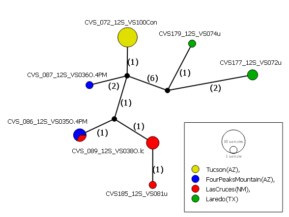

```{r setup, include=FALSE}
knitr::opts_chunk$set(echo = TRUE)
knitr::opts_chunk$set(fig.path='FigsTut1/') # this creates a folder called FigsTut1, in which all R plots are stored.
# You need to upload this folder to github along with the .MD file if you want the R output to show up
```

## AIMS OF THIS TUTORIAL :white_check_mark:

1. Assess and trim DNA chromatograms
2. Run a multiple sequence alignment algorithm using MAFFT
3. Convert files from FASTA to NEXUS format
4. Create a haplotype network in PopART
5. Read an alignment into R to:
   * Create a distance matrix and a basic neighbour joining tree
   * Create plots showing nucleotide frequencies and a heatmap for pairwise distances
   * Use the ggtree package to add colours, labels, and other tweaks to the phylogeny 

## DOCUMENT CONTENTS
1. [Getting started](#gettingstarted)
2. [View and trim chromatograms](#viewandtrim)
3. [Align sequences](#alignsequences)
4. [Create a haplotype network in PopART](#haplotypenetwork)
5. [Read genetic data into R](#readdata)
6. [Initial data exploration](#explore)
7. [Create a neighbour joining (NJ) tree](#njtree)
8. [Use ggtree](#ggtree)

## Getting started <a name = "gettingstarted"></a>

Open the "Chromatograms" folder. The sequencing facility will send you three files for each sample, namely a **.ab1**, **.pdf**, and **.txt** file. The data here are *Dactylopius opuntiae* and *D. tomentosus* 12S rRNA sequences.
For a quick ID, you can copy the FASTA sequence in the .txt file, and paste it into the [BLAST](https://blast.ncbi.nlm.nih.gov/Blast.cgi?PROGRAM=blastn&PAGE_TYPE=BlastSearch&LINK_LOC=blasthome) search engine. It will show you what the top matches are relative to what is available on the GenBank database.

## View and trim chromatograms <a name = "viewandtrim"></a>

Have a look at the PDF chromatogram of the BCCS1-green_12S file. You'll see that it's a bit messy at the beginning, up to about 70 bp. The rest looks clean, with excellent base calls. Compare this to one of the PDFs in the "Poor_quality_chromatograms" folder.

Install [Chromas](http://technelysium.com.au/wp/chromas/), and open the **BCCS1-green_12S.ab1** file. 
Scroll to the 70 bp mark, and click on the nucleotide at that point (here a C). Then Edit --> Set left trim. Then scroll to the 470 bp mark (here a G), click --> Edit --> Set right trim. Then Edit --> Delete trimmed sequences.
Click Export, and save the file with a .fasta or .fas extension.
You would do this for all the chromatograms, and then open all the resulting trimmed FASTA files in AliView, and save it as one big FASTA file. Find this final file, **12S_unaligned.fasta**, in the **FASTA files** folder. 
These sequences now need to be aligned.

## Align sequences <a name = "alignsequences"></a> :bar_chart:

Open the [MAFFT](https://mafft.cbrc.jp/alignment/server/) server, and upload the **12S_unaligned.fas** file. Select the "Same as input" radio buttons under the **UPPERCASE/lowercase** and **Output order** headings. Submit, and then click on **Fasta format** at the top of the page to download the alignment.
The resulting file is called **12S_aligned_mafft_needs_editing.fasta** in the FASTA files folder in this repository. 
The beginnings and ends of the alignmed sequences have a number of dashes. Replace these with the "N" character to signify missing data. Do not do this for dashes elsewhere in the sequences, as these indicate gaps, and may be biologically meaningful. The processed file is called **12S_aligned_mafft_ready.fasta**. 

## Create a haplotype network in PopART <a name = "haplotypenetwork"></a>

We'll use some *Dactylopius confusus* 12S rRNA sequences for this. These have already been trimmed, aligned, and prepared, and are saved in FASTA format.

PopART reads in Nexus files, and so you need to convert from .fasta to .nex. There are many online converters, but I like [EMBOSS](https://www.ebi.ac.uk/Tools/sfc/emboss_seqret/). 

Step 1: Select DNA from the drop-down list, and then upload the **12S_confusus.fasta** file.

Step 2: Select the input format to be FASTA format including NCBI-style IDs, and the output format as Nexus/paup (either interleaved or non-interleaved).

Download the .nex file, and open it in Notepad++. Delete the three lines that follow the first "end;" (begin assumptions;
options deftype=unord; end;).

This file is available as the **12S_confusus_for_popart.nex** file in this repository. You can then add a TRAITS block section below the sequences. This is used to specify groupings within your sequences (e.g. geographic location or host plant), so that you can colour your haplotype network accordingly. Have a look at the formatting in this file.

Read the **12S_confusus_for_popart.nex** file into PopART. Network --> TCS network. Change colours by clicking Edit --> Set trait colour. I prefer to see mutations as numbers, so click on View --> Show mutations as --> Numbers.




## Read genetic data into R <a name = "readdata"></a>

```{r}

if (!require("pacman")) install.packages("pacman") # pacman is a package that installs other required packages
pacman::p_load(ape, ade4, pegas, magrittr, ggplot2, ggtree)

# If you want to read in downloaded files, set your working directory accordingly
# You can easily do this by pressing ctrl + shift + H, then select the folder containing the file
# Then copy and paste the line produced in the console, for example:
# setwd("~/CBC_tuts/Tutorial_1/FASTA files")
# seqs = ape::read.dna("12S_aligned_mafft_ready.fasta", format = "fasta"")
# Otherwise just read in the data straight from the GitHub repository as shown below
seqs = ape::read.dna("https://raw.githubusercontent.com/CJMvS/CBC_Tutorials/master/Tutorial_1/FASTA%20files/12S_aligned_mafft_ready.fasta", format = "fasta")
# get a basic summary of your file:
seqs 
# create a distance matrix. This is what is used to construct a phylogenetic tree
d = ape::dist.dna(seqs, model = "TN93", pairwise.deletion = T, as.matrix = T) 
# use ?dist.dna to see which other models are available. This uses the Tamura-Nei 93 model as an example

```

## Initial data exploration <a name = "explore"></a>


```{r}
# Generate a heat-map, where the darker the colour, the greater the distance between pairs of sequences
temp <- as.data.frame(d)
ade4::table.paint(temp, cleg=0, clabel.row=.5, clabel.col=.5) # cleg is for a legend, clabel.row and clabel.col are text sizes

# Create a plot for base frequencies
basef <- matrix(NA, nrow=nrow(seqs), ncol=4)
rownames(basef) <- labels(seqs)
colnames(basef) <- c("A", "C", "G", "T")

for (i in 1: nrow(seqs)){
  
 basef[i,] <- base.freq(seqs[i,])
  
}
  
  par(mar=c(6,5,2,2))
  matplot(basef, type = "l", pch = 16, col =c("darkgreen", "blue", "black", "red"), 
          ylab = "Base frequency", xlab="", xaxt = "n", lty=1, lwd = 2)
  axis(1, at=1:nrow(seqs), labels=rownames(seqs), las=2, cex.axis = 0.5)
  legend(33, 0.3, c("A", "C", "G", "T"), lty=1, lwd = 3, bty="o", col =c("darkgreen", "blue", "black", "red"))
  abline(v=1:nrow(seqs), col="gray", lty=3)
  grid(NULL, NULL)

```

## Create a neighbour joining (NJ) tree <a name = "njtree"></a> :deciduous_tree:

Have a look [here](https://rdrr.io/cran/ape/man/plot.phylo.html) for more parameters for tree plotting.

```{r}
tree = ape::njs(d)
labels(seqs) # get a list of all the sequence names
# Root the tree on the outgroups. Here it was all the samples ending on "Ofi" (Dactylopius opuntiae 'ficus' biotype)
tree = root(tree, outgroup = c("CVS_013_12S_VS015Ofi", "CVS_034_12S_VS016Ofi", "CVS_035_12S_VS017Ofi", 
                               "CVS_128_12S_VS044Ofi", "CVS_130_12S_VS046Ofi", "CVS_129_12S_VS045Ofi"), 
                             resolve.root = T)
# Plot the tree
par(mar=c(2,2,2,2))
plot(tree, cex = 0.5, edge.color = "red", tip.color = "blue", font = 4, no.margin = T) 
# Ladderise it, and then replot:
tree %>% ladderize(.,F) %>% plot(., cex = 0.5, edge.color = "blue", tip.color = "black", font = 4, no.margin = T, edge.width = 2)
# alternative notation (note the use of the pipe operator above (%>%), using the magrittr package):
# tree = ladderize(tree, F)
# plot(tree, cex = 0.8, edge.color = "red", tip.color = "blue", font = 4)

# add a scale bar
add.scale.bar(x = 0.3, y = 1, length = 0.1)

# plot a radial tree
par(mar=c(2,2,2,2))
plot(tree, cex = 0.5, edge.color = "orange", tip.color = "darkgreen", font = 1, type = "r", no.margin = T, edge.width = 2.5) 

# or an unrooted cladogram
plot(unroot(tree),type="unrooted",cex=0.6, use.edge.length=FALSE,lab4ut="axial", no.margin=TRUE, 
     tip.color = "darkgreen", edge.colo="brown", edge.width = 2.5)
```
 
## Use ggtree <a name = "ggtree"></a>

The ggtree package offers a really great variety of options to tweak your phylogenies. Read more about it [here](https://besjournals.onlinelibrary.wiley.com/doi/full/10.1111/2041-210X.12628). Also check out [this](https://guangchuangyu.github.io/ggtree-book/chapter-ggtree.html) great site for neat ideas!
The **primates.nex** file was taken from the [10ktrees website](https://10ktrees.nunn-lab.org/Primates/dataset.html), and [from this great blog](http://www.randigriffin.com/2017/05/11/primate-phylogeny-ggtree.html). This is a .nex file for a tree that has already been created from aligned sequences.
This file is available in the **Tutorial_1 repository**. We add node numbers to the phylogeny using the geom_label2() function so that we can refer to these nodes when we want to add highlighting or labels.

```{r}
# to install ggtree, use these lines of code:

# if (!requireNamespace("BiocManager", quietly = TRUE)) install.packages("BiocManager")
# BiocManager::install("ggtree")

prim.tree = read.nexus("https://raw.githubusercontent.com/CJMvS/CBC_Tutorials/master/Tutorial_1/Data/primates.nex")

# set a general dark blue colour for the tree lines
prim1 = prim.tree %>% ggtree(., layout = "rectangular", colour = "darkblue", lwd=1.2) + xlim(0, 90) + 
  geom_tiplab(size=2.5, color="black") +
  geom_label2(aes(subset=!isTip, label=node), size=3, color="blue", alpha=0.8) # add node numbers 

plot(prim1)

# colour according to branch lengths. If your tree has posterior probabilities, you can set that as the color if you prefer
prim2 = prim.tree %>% ggtree(., aes(color=branch.length), layout = "rectangular", lwd=1.2) + xlim(0, 90) + 
  geom_tiplab(size=2.5, color="black") +
  geom_label2(aes(subset=!isTip, label=node), size=3, color="blue", alpha=0.8) + # node numbers +
  theme(legend.position="bottom") +
  scale_color_continuous(low='white', high='red', name="Branch length") +
  geom_treescale(fontsize=5, linesize=1, offset=1, x=0, y=-5, color='black') # add a scale bar

plot(prim2)

```

The following information is given regarding which clade is which primate superfamily:

* Node 124: Galagoidea
* Node 113: Lemuroidea
* Node 110: Tarsioidea
* Node 96: Ceboidea
* Node 89: Hominoidea
* Node 70: Cercopithecoidea

Using this, we can now add highlighting to specific clades, and side labels. 

```{r}
prim3 = prim.tree %>% ggtree(., aes(color=branch.length), layout = "rectangular", lwd=1.2) + xlim(0, 120) + 
  geom_tiplab(size=2.5, color="black") +
  geom_hilight(node=124, fill="yellow", alpha=0.3) + # Make Galagoidea yellow
  geom_hilight(node=96, fill="steelblue", alpha=0.3) + # Make Ceboidea steel blue
  geom_hilight(node=110, fill="orange", alpha=0.3) + # Make Tarsioidea orange
  geom_cladelabel(124, "Galagoidea", offset=25, barsize=2, angle=0, offset.text=1.5, hjust=0.1, fontsize=4) +
  geom_cladelabel(110, "Tarsioidea", offset=25, barsize=2, angle=0, offset.text=1.5, hjust=0.1, fontsize=4) +
  # change the bar size, angle the text , and change the colour for fun
  geom_cladelabel(96, "Ceboidea", offset=25, barsize=3, angle=90, offset.text=1.5, hjust=0.5, fontsize=4, colour =  "steelblue") +
  geom_treescale() + theme(legend.position="bottom") +
  scale_color_continuous(low='lightgrey', high='red', name="Branch length")
 
plot(prim3)
```

Experiment with the different layout options. For example, a radial tree:

```{r}
prim4 = prim.tree %>% ggtree(., aes(color=branch.length), layout = "circular", lwd=1.2) + xlim(0, 120) + 
  geom_tiplab(size=2.5, color="black") +
  geom_hilight(node=124, fill="yellow", alpha=0.3) + # Make Galagoidea yellow
  geom_hilight(node=96, fill="steelblue", alpha=0.3) + # Make Ceboidea steel blue
  geom_hilight(node=110, fill="orange", alpha=0.3) + # Make Tarsioidea orange
  geom_hilight(node=89, fill="blue", alpha=0.3) + # Make Hominoidea blue
  geom_treescale() + theme(legend.position="bottom") +
  scale_color_continuous(low='grey', high='red', name="Branch length")

plot(prim4)
```

You might have additional binary (such as presence/absence, wings/wingless, etc.), or continuous data for each individual in your phylogeny that you want to include in the graphic. You can do this using the gheatmap() function in the ggtree package.

We will first read in two made-up .csv files in the Data folder; 1) **primates_binary_traits.csv** with presence/absence data for six variables (X1 to X6), and 2) **primates_continuous.csv** with randomly generated continuous data for four variables (X1 to X4).


```{r}
traits.bin = read.csv("https://raw.githubusercontent.com/CJMvS/CBC_Tutorials/master/Tutorial_1/Data/primates_binary_traits.csv", row.names = 1) # row.names = 1 makes sure that the first column is read in as row names, not as a data column
traits.cont = read.csv("https://raw.githubusercontent.com/CJMvS/CBC_Tutorials/master/Tutorial_1/Data/primate_continuous.csv", row.names = 1)

# if you want to change column names from X's to something else, you can use this code:
colnames(traits.bin) = c("A","B","C","D", "E", "F")

# regenerate the phylogeny, but remove the clade labels to make it less cluttered
prim5 = prim.tree %>% ggtree(., aes(color=branch.length), layout = "rectangular", lwd=1.2) + xlim(0, 120) + 
# the tiplabels are offset here to make space for the additional trait data
  geom_tiplab(size=2.5, color="black", offset = 17) +
  geom_hilight(node=124, fill="yellow", alpha=0.3) + # Make Galagoidea yellow
  geom_hilight(node=96, fill="steelblue", alpha=0.3) + # Make Ceboidea steel blue
  geom_hilight(node=110, fill="orange", alpha=0.3) +  # Make Tarsioidea orange 
scale_color_continuous(low='grey', high='red', name="Branch length")
  
# add heatmap for the binary values
binary_phylo =  gheatmap(prim5, traits.bin, offset=0.2, width=0.2, colnames_position = "top", colnames_angle = 90, font.size=2, color="black", colnames_offset_y = 0.5) + 
  scale_fill_manual(values=c("white", "forestgreen"))

plot(binary_phylo)

# add heatmap for continuous values
cont_phylo = gheatmap(prim5, traits.cont, offset=0.2, width=0.2, low="white", high="forestgreen", colnames_offset_y = 0.5,
              colnames_position = "top", colnames_angle = 90, font.size=2, color="black", legend_title = "Value") 

plot(cont_phylo)

```

> That's it for the first tutorial! Stay tuned for more :).