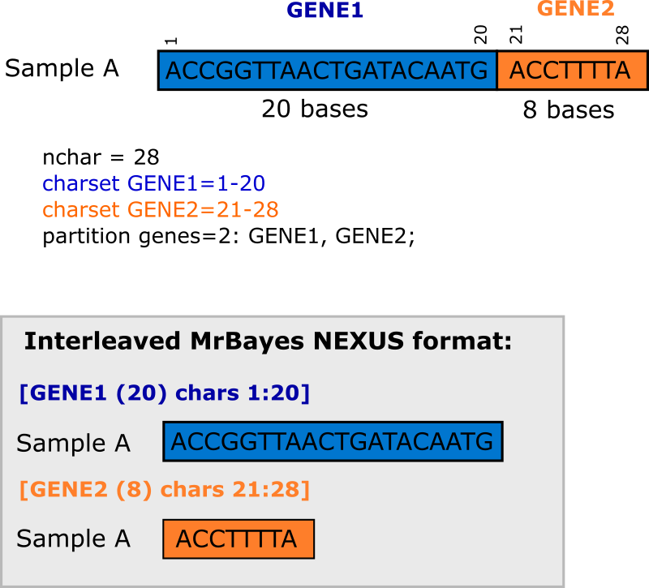
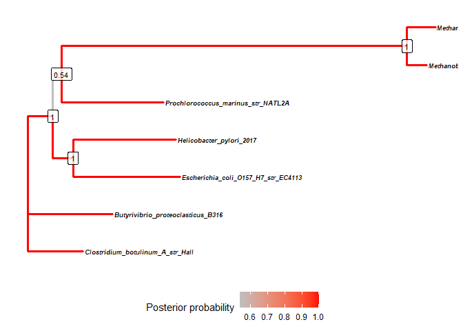
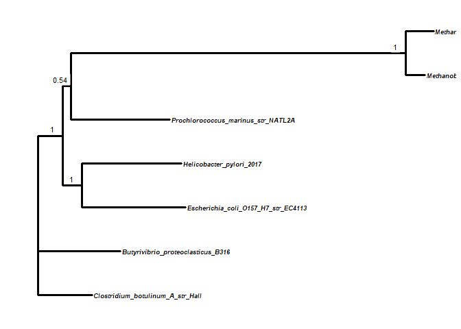
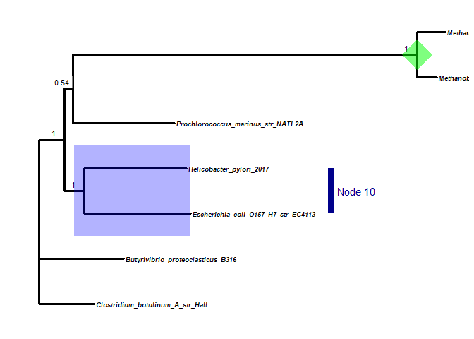
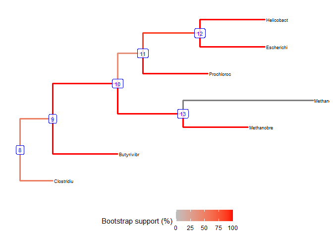
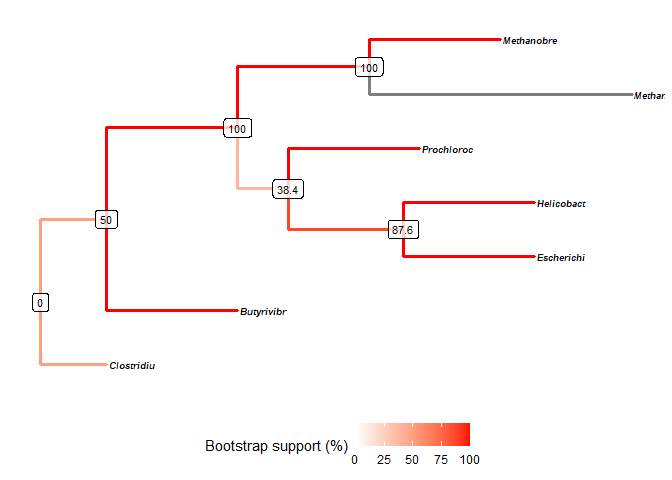
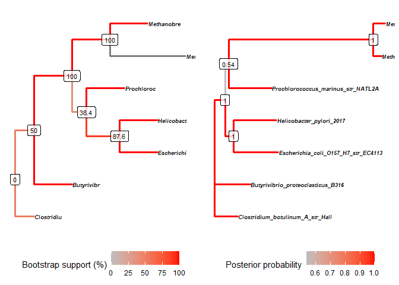
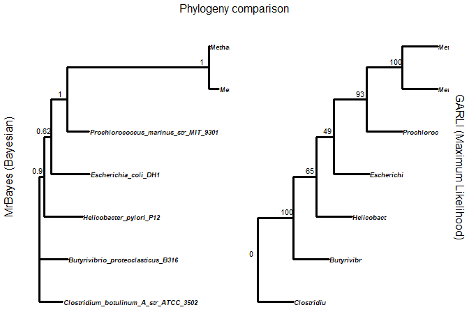

CBC Phylogenetics Tutorial 3: Concatenated Bayesian and Maximum
Likelihood Phylogenies
================
Clarke van Steenderen
Last updated 03/09/2020

## AIMS OF THIS TUTORIAL :white\_check\_mark:

1.  Create a NEXUS file for MrBayes containing more than one gene, with
    an optimal evolutionary model for each
2.  Read the Bayesian .con.tre output tree file into R and use ggtree to
    edit it
3.  Run a Maximum Likelihood tree for a single gene, and for multiple
    genes
4.  Get a consensus output ML tree, reroot and swap branches around in
    FigTree, read the result into R, and edit using ggtree
5.  Compare the topology of the two phylogenies
6.  Use IQtree as an alternative tool for ML analysis

## DOCUMENT CONTENTS

1.  [Getting started](#gettingstarted)
2.  [Use ggtree](#ggtree)
3.  [Prep for a Maximum Likelihood analysis](#ML)
4.  [View the ML tree using ggtree](#ggtreeML)
5.  [IQtree](#iqtree)

## Getting started <a name = "gettingstarted"></a>

### Creating a concatenated gene NEXUS file

We will use more bacterial sequences again for this tutorial. First, we
need to upload the 5S.fas, 16S.fas, and 23S.fas aligned sequence files
onto CIPRES. Following the instructions in Tutorial 2, we need to run
jModelTest on each file to find the optimal evolutionary models for each
gene alignment (we have already done this for 16S in Tut 2). In the
meanwhile, we can create a NEXUS file for each gene, using the
[EMBOSS](https://www.ebi.ac.uk/Tools/sfc/emboss_seqret/) converter
(these .nex files are all in the **Aligned\_FASTA\_files** folder. Take
note of the number of characters in each gene (5S = 108; 16S = 1377; 23S
= 2746). You can then copy and paste each gene’s nexus block into one
file (see the final
[**bacteria.concat.mrbayes.nex**](https://github.com/CJMvS/CBC_Tutorials/blob/master/Tutorial_3/MrBayes/bacteria.concat.mrbayes.nex)
file). Make sure that the order of the sequences remains exactly the
same. Above each gene block, I like to put character information in
square brackets (this will not be read by the program, it’s just for
your own use). So for example, the 5S block starts with **\[5S (108)
chars 1:108\]**, reminding me that it comprises 108 characters, and in
the model specifications, the model for this must be applied to
characters 1 through to 108. Similarly, for 16S: **\[16S (1377) chars
109:1485\]**. In the model specifications, you want to apply certain
settings to characters 109 to 1485 (108 + 1377). The same logic applies
to the last gene block (23S). Be sure to set the **nchar** parameter at
the top of the document to the full size of the data, i.e. 4231. Delete
the three lines that follow the first “end;” (begin assumptions; options
deftype=unord; end;) at the bottom of the document. Have a look at the
[**optimal\_models.txt**](https://github.com/CJMvS/CBC_Tutorials/blob/master/Tutorial_3/Aligned_FASTA_files/optimal_models.txt)
file in the **Aligned\_FASTA\_files** folder for a summary of the
results of jModelTest for each gene.

> The template below can be used for inserting the best models for each
> gene block. The 1-x and x+1-y means “Gene 1 spans from nucleotide 1 to
> nucleotide x”, and “Gene2 spans from nucleotide x + 1 to y”,
> respectively. Light blue highlighting shows the model parameters for
> GENE1, and yellow for GENE2.

begin mrbayes;  
<mark style="background-color: lightblue"> CHARSET GENE1=1-x; </mark>  
<mark style="background-color: yellow"> CHARSET GENE2=x+1-y; </mark>  
partition genes=2: GENE1, GENE2;  
set partition = genes;  
set autoclose=yes nowarn=yes;  
<mark style="background-color: lightblue"> lset applyto=(1) nst= rates=
ngammacat=4 code=universal; </mark>  
<mark style="background-color: yellow"> lset applyto=(2) nst= rates=
ngammacat=4 code=universal; </mark>  
outgroup ;  
unlink shape=(all) pinvar=(all) statefreq=(all) revmat=(all);  
<mark style="background-color: lightblue"> prset applyto=(1) revmatpr =
fixed(6 values) statefreqpr = fixed(4 values) </mark>  
<mark style="background-color: lightblue"> shapepr = fixed() pinvarpr =
fixed(pinvar) tratiopr = fixed(kappa value); </mark>  
<mark style="background-color: yellow"> prset applyto=(2) revmatpr =
fixed(6 values) statefreqpr = fixed(4 values) </mark>  
<mark style="background-color: yellow"> shapepr = fixed() pinvarpr =
fixed(pinvar) tratiopr = fixed(kappa value); </mark>  
link topology=(all) brlens=(all);  
mcmc ngen=20000000 printfreq=1000 samplefreq=1000 nchains=4
savebrlens=yes starttree=random;  
sumt relburnin=yes burninfrac=0.25;  
sump relburnin=yes burninfrac=0.25;  
end;

The diagram below gives a graphical representation of how we’re laying
out this NEXUS file, and partitioning genes: <br/> <br/>

 <br/> <br/>

> We will use the summary information in the **optimal\_models.txt**
> file to fill out the template for three genes, and we’ll set the run
> to 20 million generations with a sampling frequency of 1000.

begin mrbayes;  
\[Partition your data using CHARSET\]  
<mark style="background-color: lightblue"> CHARSET **5S=1-108**;
</mark>  
<mark style="background-color: yellow"> CHARSET **16S=109-1485**;
</mark>  
<mark style="background-color: lightgreen"> CHARSET **23S=1486-4231**;
</mark>  
partition genes=**3: 5S,16S,23S**;  
set partition = genes;  
set autoclose=yes nowarn=yes;  
<mark style="background-color: lightblue"> lset applyto=(1) nst= 6
rates= propinv ngammacat=4 code=universal; </mark>  
<mark style="background-color: yellow"> lset applyto=(2) nst= 6 rates=
gamma ngammacat=4 code=universal; </mark>  
<mark style="background-color: lightgreen"> lset applyto=(3) nst= 6
rates= gamma ngammacat=4 code=universal;</mark>  
outgroup Clostridium\_botulinum\_A\_str\_Hall;  
unlink shape=(all) pinvar=(all) statefreq=(all) revmat=(all);  
<mark style="background-color: lightblue"> prset applyto=(1)
revmatpr=fixed(0.4215, 2.3291, 1.0000, 0.4215, 2.3291, 1.0000) pinvarpr
= fixed(0.1090); </mark>  
<mark style="background-color: yellow"> prset applyto=(2)
revmatpr=fixed(0.5943, 1.4398, 1.0000, 0.5943, 3.0841, 1.0000)
statefreqpr=fixed(0.2516, 0.2276, 0.3115, 0.2093) shapepr=fixed(0.4520);
</mark>  
<mark style="background-color: lightgreen"> prset applyto=(3)
revmatpr=fixed(0.5639, 1.2359, 1.0000, 0.5639, 2.6979, 1.0000)
statefreqpr=fixed(0.2630, 0.2073, 0.3064, 0.2233) shapepr=fixed(0.5930);
</mark>  
link topology=(all) brlens=(all);  
mcmc ngen=20000000 printfreq=1000 samplefreq=1000 nchains=4
savebrlens=yes starttree=random;  
sumt relburnin=yes burninfrac=0.25;  
sump relburnin=yes burninfrac=0.25;  
end;

> :warning: Be very careful with commas and semi-colons. One incorrect
> syntactical issue, and MrBayes will stop running and report an error.

Upload this prepared NEXUS file to [CIPRES](http://www.phylo.org/), and
create a task with “MrBayes on XSEDE” set as the tool. The rest of the
instructions are the same as the previous tutorial.

As outlined in Tutorial 2, you would open the two .p files (run1 and
run2) from the analysis in Tracer to check for mcmc convergence (ESS
values \> 200). We’ll now open the
[**concat\_20M.tre**](https://github.com/CJMvS/CBC_Tutorials/blob/master/Tutorial_3/MrBayes/concat_20M.tre)
(in the MrBayes folder) file in R and use ggtree to plot the phylogeny.

## Use ggtree <a name = "ggtree"></a>

``` r
if (!require("pacman")) install.packages("pacman") # pacman is a package that installs other required packages
```

    ## Loading required package: pacman

``` r
pacman::p_load(ape, ade4, pegas, magrittr, ggplot2, ggtree, treeio, gridExtra)

bac.concat.20M = treeio::read.mrbayes("https://raw.githubusercontent.com/CJMvS/CBC_Tutorials/master/Tutorial_3/MrBayes/concat_20M.tre")

# Plot the phylogeny  with branches coloured according to posterior probability values, and add node numbers 
iotree = bac.concat.20M %>% ggtree(., aes(color=as.numeric(prob)), layout = "rectangular", lwd=1.2) + 
  geom_tiplab(size=2.5, color="black", font = 4) +
  geom_label2(aes(subset=!isTip, label=node), size=3, color="blue", alpha=0.8) + # add node numbers 
  theme(legend.position="bottom") +
  scale_color_continuous(low='grey', high='red', name="Posterior probability") 

iotree
```

<!-- -->

``` r
# add posterior probability values instead of node numbers 
iotree2 = bac.concat.20M %>% ggtree(., aes(color=as.numeric(prob)), layout = "rectangular", lwd=1.2) +
  geom_tiplab(size=2.5, color="black", font = 4) +
  geom_label2(aes(subset=!isTip, label=round(as.numeric(prob),2)), size=3, color="black", alpha=0.8) + 
  theme(legend.position="bottom") +
  scale_color_continuous(low='grey', high='red', name="Posterior probability") 

iotree2
```

<!-- -->

``` r
# just have plain black branches, but add posterior probability values
iotree3 = bac.concat.20M %>% ggtree(., color = "black", layout = "rectangular", lwd=1.2) +
  geom_tiplab(size=2.5, color="black", font = 4) +
  geom_label2(aes(subset=!isTip, label=round(as.numeric(prob),2)), size=3, color="black", alpha=0.5, label.size = 0, nudge_x = -0.025, nudge_y = 0.15)  # posterior probs. label.size = 0 removes the border around the labels 

iotree3
```

<!-- -->

``` r
# add in a blue highlight block for node 10, and add a vertical label
iotree4 = bac.concat.20M %>% ggtree(., color = "black", layout = "rectangular", lwd=1.2) +
  geom_tiplab(size=2.5, color="black", font = 4) +
  geom_label2(aes(subset=!isTip, label=round(as.numeric(prob),2)), size=3, color="black", alpha=0.5, label.size = 0, nudge_x = -0.025, nudge_y = 0.15) + # posterior probs 
  geom_hilight(node=10, fill="blue", alpha=0.3) +
  geom_cladelabel(10, "Node 10", offset=0.32, barsize=3, angle=0, offset.text=0.055, hjust=0.5, fontsize=4, colour ="darkblue") +
  geom_point2(aes(subset=node==12), color='green', size=15, pch = 18, alpha = 0.5) # add a green diamond shape to node 12

iotree4
```

<!-- -->

> :bulb: If you want to make sure that gene alignments can be
> concatenated (i.e. their topologies are congruent), first create a
> neighbour joining phylogeny for each individual gene in MEGA. Make
> sure that the number of sequences, and the names are exactly the same
> in both, and save each in **Newick** format. Upload these to the
> [**ICONG**](http://max2.ese.u-psud.fr/icong/index.help.html) server.

## Prep for a Maximum Likelihood (ML) analysis <a name = "ML"></a>

There are many programs that offer ML analyses, but I found GARLI to be
a great one, as it can handle mutliple genes that have been partitioned
in a NEXUS file. Another possible program to experiment with is
[IQTree](https://academic.oup.com/mbe/article/32/1/268/2925592). We’ll
use GARLI for now.

A quick overview of this process:

> Slightly modify the NEXUS file used for MrBayes –\> Create a
> configuration file specifying models for each gene partition –\>
> Upload to GARLI and specify bootstrap repetitions –\> Download the
> **allBootTrees.tre** file (if you ran 500 bootstraps, then this file
> will contain 500 trees. You need to get on consensus tree from all of
> these) –\> Convert this NEXUS file to PHYLIP using NCL Converter on
> CIPRES –\> Input the .phy file to CONSENSE on CIPRES –\> download the
> final .tre file

We will run a ML analysis on the concatenated dataset using GARLI on
CIPRES (select the “GARLI XSEDE” tool). If inputting a concatenated
dataset, the input file must be in NEXUS format. Single genes can be
FASTA if preferred.

To prep a NEXUS file for input, create a copy of the file used for the
MrBayes run. Delete the Bayesian block at the bottom of the document,
and add this:

begin sets;  
CHARSET 5S=1-108;  
CHARSET 16S=109-1485;  
CHARSET 23S=1486-4231;  
CHARPARTITION byPos = all:5S, all:16S, all:23S;  
end;

This file is available in the **GARLI** folder as
[**bacteria.concat.garli.nex**](https://github.com/CJMvS/CBC_Tutorials/blob/master/Tutorial_3/GARLI/bacteria.concat.garli.nex).
The files mentioned hereafter are all in this same folder.

Now we need to create a configuration file (.conf extension). Use the
template saved as
[**bacteria.concat.conf\_file.conf**](https://github.com/CJMvS/CBC_Tutorials/blob/master/Tutorial_3/GARLI/bacteria.concat.conf_file.conf).
This was gleaned from
[here](http://www.peter.unmack.net/molecular/programs/garli.instructions.html).
The [GARLI configuration
settings](https://molevol.mbl.edu/index.php/GARLI_Configuration_Settings)
and [GARLI
FAQ](https://molevol.mbl.edu/index.php/Garli_FAQ#MODELTEST_told_me_to_use_model_X._How_do_I_set_that_up_in_GARLI.3F%22)
pages are very useful. For help with setting the correct model
specifications, refer to Table 1 in this
[jModelTest](https://academic.oup.com/mbe/article/25/7/1253/1045159)
paper (for quick reference, see the
[**jModelTest\_options.xls**](https://github.com/CJMvS/CBC_Tutorials/blob/master/Tutorial_3/GARLI/jModelTest_options.xlsx)
file).

Leave all the settings exactly as they are, and only change the outgroup
parameter, and the model blocks. Keep outgroups together in your NEXUS
file, so that you can refer to them as, for example, outgroup = 1-5. The
outgroups are set by referring to their position in the data (sequence
numbers 1 to 5), not by names. Here we’re setting
*Clostridium\_botulinum\_A\_str\_Hall* as the outgroup again. Here it is
the second sequence in the .nex file, so outgroup = 2.

The model parameter template for a .conf file is:

\[model1\]  
numratecats =  
ratehetmodel =  
ratematrix =  
invariantsites =  
statefrequencies =  
datatype = nucleotide

  - **numratecats = 1** for any model without a gamma value (“+ G”), or
    **numratecats = 4** for any other model.  
  - **ratehetmodel = none** for any model without a gamma value (“+ G”),
    or **ratehetmodel = gamma** for a model with a “+ G”.  
  - **invariantsites = none** for a model without a “+ I”, or
    **invariantsites = estimate** for models with a “+ I”.  
  - ratematrix is substitution/partition code of the model. For example,
    the TPM3 model for the 5S rRNA data in this tutorial has a partition
    code of 012012. You can get this from the results of your jModelTest
    run, or from [the jModelTest
    paper](https://academic.oup.com/view-large/18726546) mentioned
    above. The syntax for the .conf file should be:  
    **ratematrix = (0 1 2 0 1 2)** (note the brackets and spaces).
  - **statefrequencies** is set to either **equal** or **estimate**. Get
    this from [the jModelTest
    paper](https://academic.oup.com/view-large/18726546) as well, where
    “unequal” should be set to “estimate” in the .conf file.

Using the model selected for the 5S rRNA alignment:

> Model = TPM3+I  
> partition = 012012

The .conf settings would be:

\[model1\]  
numratecats = 1  
ratehetmodel = none  
ratematrix = (0 1 2 0 1 2)  
invariantsites = estimate  
statefrequencies = equal  
datatype = nucleotide

:exclamation: Square brackets in a nexus file for MrBayes are not read,
but in a .conf file, they are. Leave \[model1\], \[model2\], and so on
exactly as they are; do not change the model names. Set bootstrapreps to
1 in the conf file.  
Be sure to have each model block listed in the same order as they appear
in the aligned NEXUS file. In this example, it’s 5S \[model1\], 16S
\[model2\], and 23S \[model3\].

Once you have uploaded the **bacteria.concat.garli.nex** file and the
**bacteria.concat.conf\_file.conf** file to CIPRES and selected the
GARLI tool, select *“I would like to provide my own GARLI configuration
file (for help, see the GARLI.conf Creator tool)”* and *“The garli.conf
file was created outside of CIPRES”*, and then select the .conf file
from the dropdown list. Set **memory to 2000-4999**. Select *“I have set
the values of searchreps and bootstrapreps correctly”*, and set
**bootstrapreps to 500** (one would typically run 1000, but this is just
a demo). Leave the independent search replicates at 2. Save and run
task.

Once the run has completed, scroll right to the bottom of the output
results page, and save the **allBootTrees.tre** file. This is in the
GARLI folder if you want to have a look
([**bacteria.concat.allBootTrees.tre**](https://github.com/CJMvS/CBC_Tutorials/blob/master/Tutorial_3/GARLI/bacteria.concat.allBootTrees.tre)).

> :bulb: To make things quicker, you can download the output straight
> back into your current CIPRES data folder instead of downloading it
> locally, and then re-uploading it. View the output file, and then save
> it to your current folder with an altered name if desired.

Create a new task in CIPRES, select **bacteria.concat.allBootTrees** as
input, and select NCLconverter as the tool. In the parameter settings,
only change the output format to “Phylip”. Save and run task. Save the
**out.tre** file (if you want to see this file, it’s saved as
**bacteria.GARLI.converted\_to\_phylip.tre**).

Create a new CIPRES task, set this phylip file as input, and the tool as
CONSENSE. No need to change any parameter settings here apart from the
run time memory, if one is working with a very large file.  
Download the **outtree** file.

I first opened this file in FigTree to reroot it on
*Clostridium\_botulinum\_A\_str\_Hall*. I then saved this as a NEXUS
tree (File –\> Export trees)
([**bacteria\_GARLI\_FIGTREE\_outtree.nex**](https://github.com/CJMvS/CBC_Tutorials/blob/master/Tutorial_3/GARLI/bacteria_GARLI_FIGTREE_outtree.nex)).
This file can now be opened in R.

## View the ML tree using ggtree <a name = "ggtreeML"></a>

Open this NEXUS file in R:

``` r
# you can read the final tree from CONSENSE straight into R using the commented-out line below:
# garli = treeio::read.tree("bacteria_GARLI_outtree")

# But I'll rather use the Nexus file saved from FigTree, after re-rooting it on C. botulinum
garli = treeio::read.nexus("https://raw.githubusercontent.com/CJMvS/CBC_Tutorials/master/Tutorial_3/GARLI/bacteria_GARLI_FIGTREE_outtree.nex")
garli$edge.length # these are out of 500 bootstrap repeats
```

    ##  [1]  250  500  500  192  500  438  500  500  500  500 1000  250

``` r
garli$edge.length = garli$edge.length/500*100 # get these values as percentages

# colour according to branch lengths (which are actually bootstrap values here). 
garlitree = garli %>% ggtree(., aes(color=branch.length), layout = "rectangular", lwd=1.2) + 
  geom_tiplab(size=2.5, color="black") +
  geom_label2(aes(subset=!isTip, label=node), size=3, color="blue", alpha=0.8) + # node numbers +
  theme(legend.position="bottom") +
  scale_color_continuous(low="white", high="red", limits=c(0,100), name="Bootstrap support (%)") # the limits parameter just forces the scale to have a max and min value of 0 and 100, respectively. Otherwise it sometimes includes a max value that is off the scale.

plot(garlitree)
```

<!-- -->

``` r
# add bootstrap values instead of node numbers 
garlitree2 = garli %>% ggtree(., aes(color=branch.length), layout = "rectangular", lwd=1.2) +
  geom_tiplab(size=2.5, color="black", font = 4) +
  geom_label2(aes(subset=!isTip, label=branch.length), size=3, color="black", alpha=0.8) + 
  theme(legend.position="bottom") +
  scale_color_continuous(low="white", high="red", limits=c(0,100), name="Bootstrap support (%)") 

# rotate the branches so that it matches the topology of the Bayesian tree we created earlier
garlitree2 = rotate(garlitree2, 12) 
garlitree2 = rotate(garlitree2, 10)

plot(garlitree2)
```

<!-- -->

``` r
# compare the ML tree to the Bayesian:
gridExtra::grid.arrange(iotree2, garlitree2, ncol=2, left = "MrBayes (Bayesian)", right = "GARLI (Maximum Likelihood)", top = "Phylogeny comparison") # the gridExtra package allows you to plot multiple graphics together
```

<!-- -->

``` r
# Sequence names are cut off if they are long. Instead of setting margins, it's easier to edit this in Inkscape
```

If you want a ML phylogeny for just one gene, everything is done in
exactly the same way, but you’ll only have the one model block in the
.conf file, and you can delete the **begin sets** block under the
sequences in the NEXUS file. Have a look in the **GARLI\_16S\_only**
folder for the aligned NEXUS file
([16S\_garli\_aligned\_seqs.nex](https://github.com/CJMvS/CBC_Tutorials/blob/master/Tutorial_3/GARLI_16S_only/16S_garli_aligned_seqs.nex))
and the .conf configuration file
([16S\_garli\_conf\_file.conf](https://github.com/CJMvS/CBC_Tutorials/blob/master/Tutorial_3/GARLI_16S_only/16S_garli_conf_file.conf))
that you would use for this, as well as the outtree file
([GARLI\_outtree](https://github.com/CJMvS/CBC_Tutorials/blob/master/Tutorial_3/GARLI_16S_only/GARLI_outtree))
that you will end up with.  
*Clostridium\_botulinum\_A\_str\_Hall* is set as the outgroup again,
which is the seventh sequence in the alignment, and 1000 bootstrap
repetitions were run.

After going through the process of converting the allBootTrees file to
phylip format, getting a consensus tree (as explained in this tut), and
saving the tree in NEXUS format in FigTree
([GARLI\_outree.nex](https://github.com/CJMvS/CBC_Tutorials/blob/master/Tutorial_3/GARLI_16S_only/GARLI_outree.nex)),
let’s compare the ML 16S output to the MrBayes output from tutorial 2:

``` r
# MrBayes tree (20 million generations) from the previous tutorial (tut 2):

bac.tree.20M = treeio::read.mrbayes("https://raw.githubusercontent.com/CJMvS/CBC_Tutorials/master/Tutorial_2/MrBayes/infile.nex.con_20M.tre") # read in the 20 million generation run

bayes = bac.tree.20M %>% ggtree(., color = "black", layout = "rectangular", lwd=1.2) +
  geom_tiplab(size=2.5, color="black", font = 4) +
  geom_label2(aes(subset=!isTip, label=round(as.numeric(prob),2)), size=3, color="black", alpha=0, label.size = 0, nudge_x = -0.03, nudge_y = 0.15)  

# the ML tree run in GARLI for just the 16S sequences, saved as a NEXUS file from FigTree:

garli16S = treeio::read.nexus("https://raw.githubusercontent.com/CJMvS/CBC_Tutorials/master/Tutorial_3/GARLI_16S_only/GARLI_outree.nex")
garli16S$edge.length # these are out of 1000 bootstrap repeats
```

    ##  [1] 1000  647 1000  489  927 1000 1000 1000 1000 1000 1000 1000

``` r
garli16S$edge.length = garli16S$edge.length/1000*100 # get these values as percentages


ML =garli16S %>% ggtree(., color = "black", layout = "rectangular", lwd=1.2) +
  geom_tiplab(size=2.5, color="black", font = 4) +
  geom_label2(aes(subset=!isTip, label=round(branch.length,0)), size=3, color="black", alpha=0, label.size = 0, nudge_x = -18, nudge_y = 0.15)  

# Compare the two phylogenies side by side:
gridExtra::grid.arrange(bayes, ML, ncol=2, left = "MrBayes (Bayesian)", right = "GARLI (Maximum Likelihood)", top = "Phylogeny comparison")
```

<!-- -->

## IQ-TREE <a name = "iqtree"></a>

IQ-TREE is a rapid tool that creates maximum likelihood phylogenies, and estimates the best evolutionary models for the input data (with our without partitions). 
The [IQ-TREE site](http://www.iqtree.org/doc/Web-Server-Tutorial#tree-inference) has an option for using a web server to run an analysis. You just need to upload your alignment and partition file (in any of the example formats they present), and then open the file with the extension .phy.treefile in R, or Figtree.

> :books: Tutorial 4 will have a look at working with microsatellite
> (SSR) data.
