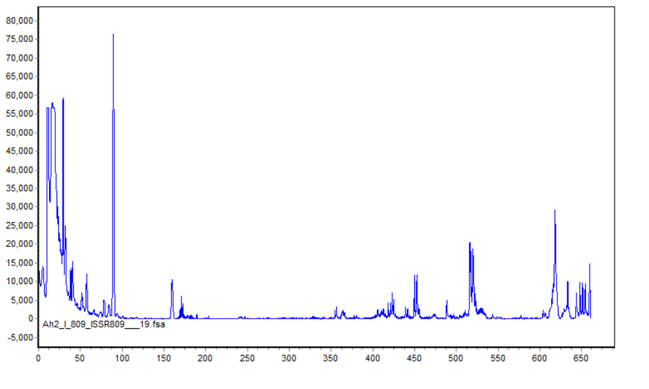
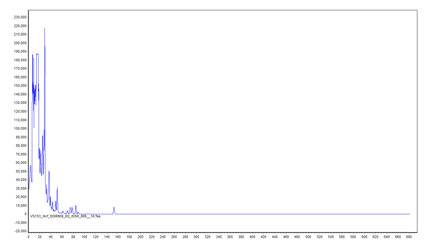
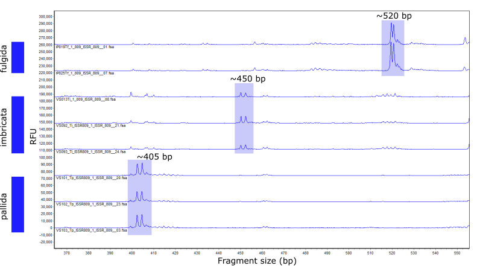
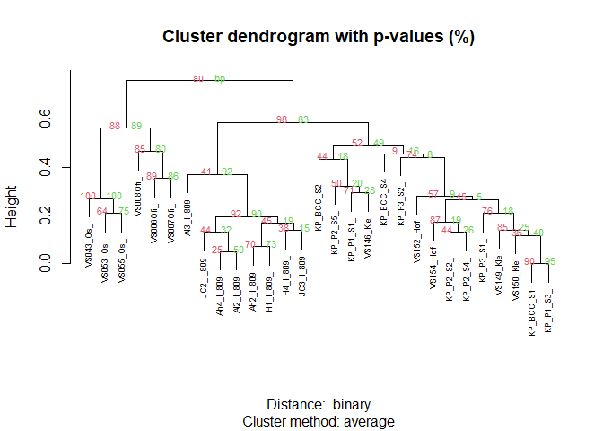
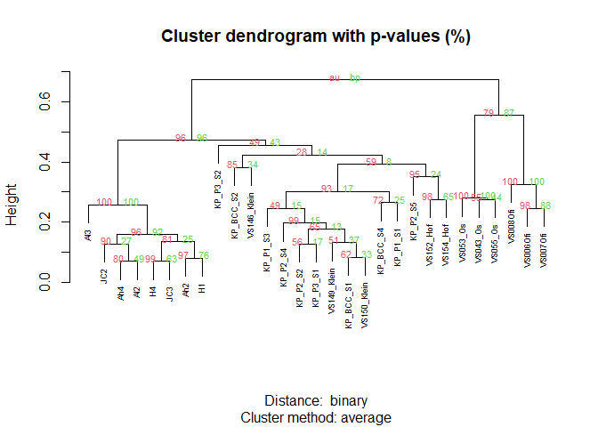
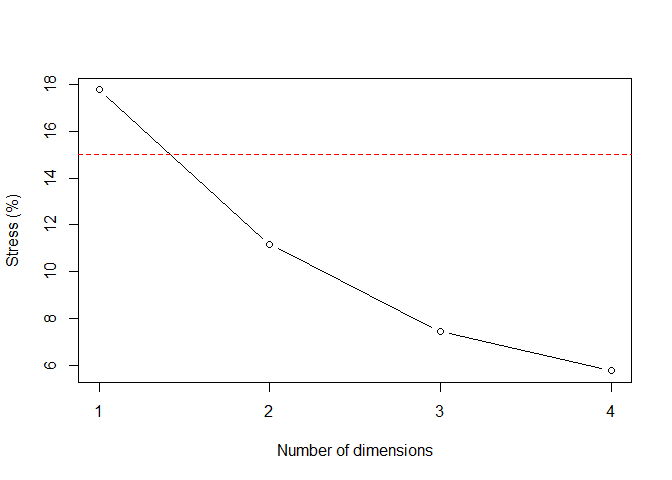
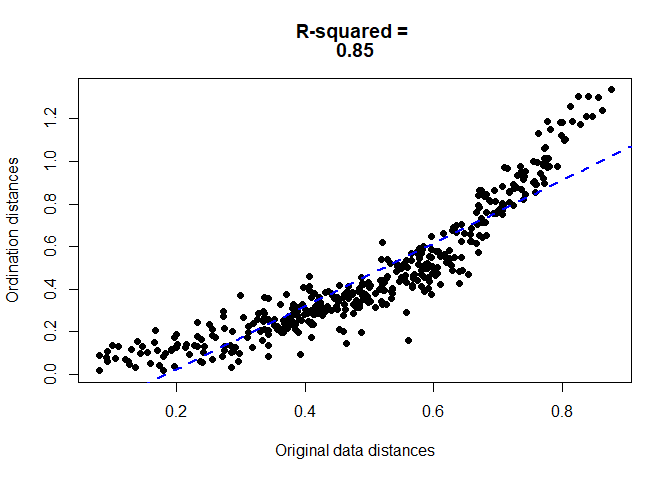
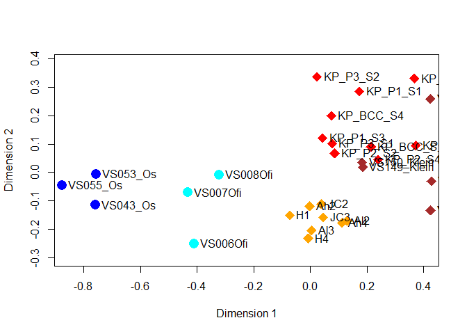
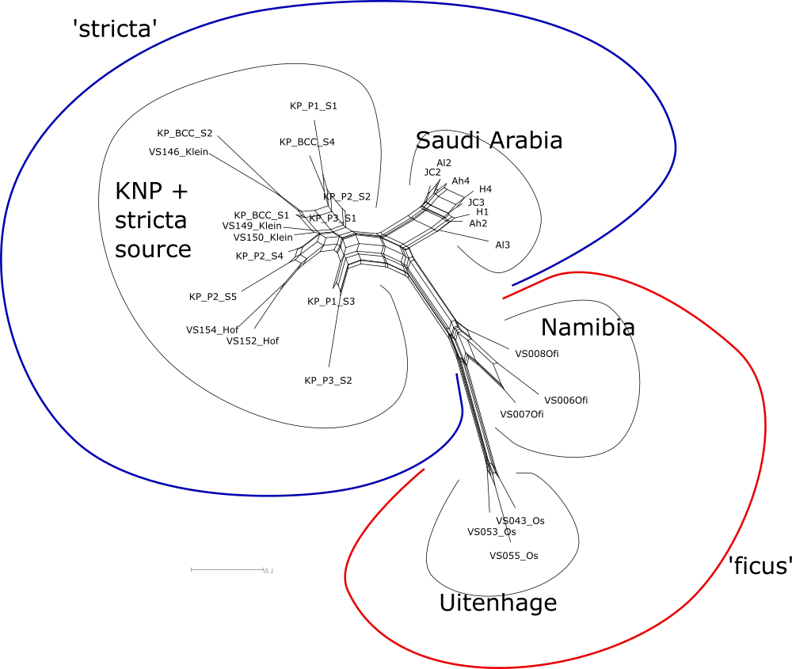
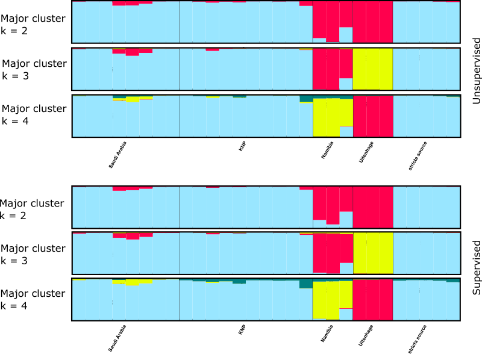

CBC Phylogenetics Tutorial 5: ISSR analysis
================
Clarke van Steenderen
16/09/2020

## AIMS OF THIS TUTORIAL :white\_check\_mark:

1.  Read raw ISSR electropherograms for different markers/primers into
    GeneMarker, score peaks, and save a peak table
2.  Read the peak table into RawGeno to produce a binary matrix (0s and
    1s for the presence and absence of peaks)
3.  Organise the binary data into replicate pairs and create a consensus
    output for each sample using the BinMat R package
4.  Concatenate the results of different ISSR primers into one big data
    file
5.  Create hierarchical clustering trees (UPGMA) and non-dimensional
    scaling (nMDS) plots
6.  Calculate Jaccard and Euclidean error rates, and get peak summary
    information
7.  Run SplitsTree
8.  Run a supervised and unsupervised STRUCTURE analysis

## DOCUMENT CONTENTS

1.  [ISSR electropherograms](#issr_electropherograms)
2.  [RawGeno](#rawgeno)
3.  [BinMat](#binmat)
4.  [Non-metric multidimensional Scaling Plots and UPGMA
    dendrograms](#nmds)
5.  [SplitsTree](#splitstree)
6.  [STRUCTURE](#structure)
7.  [Supervised vs unsupervised STRUCTURE analysis](#compare_structure)

## ISSR electropherograms <a name = "issr_electropherograms"></a>

When running ISSR PCRs, you should replicate each sample in a different
PCR machine. ISSR fragment data usually gets sent back to you as
**.fsa** files.

In this tut, we’ll look at electropherograms from 58 **Dactylopius
opuntiae** samples (29 replicated samples), from two ISSR primers: ISSR
809 and ISSR 826. In total, this was 116 PCRs\!

> :bulb: I recommend that you rename the .fsa files to start with the
> actual sample name (the sequencing facility sends them back with a
> code prefix). Renaming ensures that the replicate pairs remain
> together.

Download and install the GeneMarker trial 35-day .exe file (email
[GeneMarker](https://softgenetics.com/GeneMarker.php) to get the
download).

Open data –\> Add –\> Select all the ISSR809 .fsa files in the
[**Tutorial\_5/ISSR\_electropherograms/ISSR809**](https://github.com/CJMvS/CBC_Tutorials/tree/master/Tutorial_5/ISSR_electropherograms/ISSR809)
folder –\> Run –\> Set the size standard (check which was used by the
sequencing facility. It’s usually LIZ500, in which case you can set it
to **GS500** here) –\> set analysis type to **AFLP** (like ISSRs, AFLPs
are also dominant markers) –\> set **Min intensity** to 50 RFU (be quite
permissive at this stage, as we’re just doing some basic filtering. More
stringent parameters will be set later in RawGeno) –\> select **AFLP
normalization**, and leave the blue box checked (blue = FAM dye, which
have marked your peaks)

The first sample, Ah2\_I\_809\_ISSR809\_19.fsa, looks like this:

 :bulb: You’ll see that the peaks up to the first 100
or so base pairs in size are quite messy. We’ll keep these in for now,
but will remove them later in RawGeno.

All the files read in should have green page symbols next to them,
signifying that they were successfully scored. You will very quickly see
which samples didn’t work, as there will be a flat line, or the peaks
will be very messy. Something like the electropherogram below would need
to be re-run:



Check each sample carefully, and delete the ones that did not work.

> :pencil: Only use data for which both replicates worked. I’ve tried to
> include only one primer, and then fill the missing one with ?, but it
> doesn’t produce reliable output.

If you go to **Applications** –\> **Overlay View**, you can select
specific files to view together. Move the **2D slider** bar to adjust
the spacing between samples. Move from left to right by right-clicking
and dragging across the screen. Left click and drag a square over an
area of interest to zoom in on it. You can start looking for
characteristic peaks. For example, these are some *Dactylopius
tomentosus* biotypes where characterstic peaks are shown highlighted in
blue:



#### Export a summary peak table

At the top right of the window, select **Report settings** –\> select
**Peak table** –\> deselect **Abide by panel**, **Show Only Uncertain
Alleles**, and **Show Rejected Low Score Alleles** –\> delete the two
asterisks in the **show when no allele call** –\> select the **columns**
button, and move all the columns on the left to the selected list on the
right (through \[a lot of\] trial and error, I found that not doing this
gives an error when reading this table into RawGeno) –\> Save the output
as a .txt file
([**ISSR809\_AlleleReport.txt**](https://github.com/CJMvS/CBC_Tutorials/blob/master/Tutorial_5/GeneMarker%20Allele%20Reports/ISSR809_AlleleReport.TXT)).

### RawGeno <a name = "rawgeno"></a>

Download the RawGeno v2.0-2 tar.gz file
[here](https://sourceforge.net/projects/rawgeno/files/rawgeno/RawGeno%202.0-2/),
or find it in this [tutorial
folder](https://github.com/CJMvS/CBC_Tutorials/blob/master/Tutorial_5/RawGeno_2.0-2.tar.gz).
The .zip folder doesn’t seem to work on R version 4. Follow the
instructions on the page to install. I recommend saving the tar.gz file
to the Desktop, and then setting the Desktop as the working directory in
R (Session –\> set working directory –\> choose working directory –\>
select the desktop). Alternatively, you can go to Tools –\> install
packages –\> then select install from: package archive file –\> Install.

Make sure that you have the **vegan** and **tkrplot** packages
installed. Run RawGeno using:

require(RawGeno)  
require(vegan)  
RawGeno()

Go to Files –\> Electroph. –\> PeakScanner, GeneMarker or Peakscan
(.txt) –\> select the folder where the
[**ISSR809\_AlleleReport.txt**](https://github.com/CJMvS/CBC_Tutorials/blob/master/Tutorial_5/GeneMarker%20Allele%20Reports/ISSR809_AlleleReport.TXT)file
from GeneMarker is saved –\> insert file –\> keep the dye colour
selected on Blue –\> continue

A green graph will appear, where you can discard samples with the
highest and lowest numbers of peaks. Here, the highest was 132 peaks,
and the lowest 48. Drag the rectangle to cover the desired range.
Typically, you would discard 5% of the smallest peaks, and 5% of the
higher ones (marked with dashed lines). For this analysis, let’s keep
all of them. Click on **START**.

Now go to **Scoring** –\> BINNING parameters: set maximum bin width to 1
–\> minimum bin width to 0.5 –\> SCORING range: from 100 to 500 bp (here
we cut off the messy bit at the beginning) –\> FILTERING parameters: Low
Fluorescence Bins to 100 –\> START

> For optimal parameter settings, have a look
> [here](https://www.researchgate.net/publication/225186282_Automated_scoring_of_AFLPs_using_rawgeno_v_20_a_free_R_CRAN_library).

Click on **Save** –\> Save/ export currently scored dataset –\> select
**transposed binary table** –\> select the desired export directory –\>
save. You will see a file called **BinaryDataT.txt** file written to the
selected directory. Rename it so that you know it is for ISSR809
([**DataBinaryT\_ISSR809.txt**](https://github.com/CJMvS/CBC_Tutorials/blob/master/Tutorial_5/RawGeno%20output/DataBinaryT_ISSR809.txt)).

Open this file in Excel, and check that each replicate pair is together.
Cut the first row, and paste it one cell to the right; such that the
first locus number starts in the second column (column B). Save as a
.csv file
([**DataBinaryT\_ISSR809.csv**](https://github.com/CJMvS/CBC_Tutorials/blob/master/Tutorial_5/RawGeno%20output/DataBinaryT_ISSR809.csv)).

### BinMat <a name = "binmat"></a>

The next step is to consolidate each replicate pair into one consensus
read. For example, let’s say that we have this replicate pair:

**SampleA\_rep1** 0 1 1 0  
**SampleA\_rep2** 0 1 0 0

The consensus would be:

**SampleA\_consense** 0 1 ? 0

> A zero in both means that neither sample had a peak at that locus, a 1
> in both supports the presence of a peak, and a 1 in one sample, but a
> 0 in the other at the same locus means that there is an ambiguity
> (“?”). As the dataset can be really huge, doing this manually
> would take ages, and will be very prone to errors.

We will use the BinMat R Shiny application to do this automatically.
BinMat is also available as an [R
package](https://cran.r-project.org/web/packages/BinMat/index.html) that
can be downloaded from CRAN.

Let’s use both methods (server GUI (graphical user interface) and R
package):

#### BinMat Shiny Server

Open the [BinMat Shiny URL
link](https://clarkevansteenderen.shinyapps.io/BINMAT/), and upload the
[**DataBinaryT\_ISSR809.csv**](https://github.com/CJMvS/CBC_Tutorials/blob/master/Tutorial_5/RawGeno%20output/DataBinaryT_ISSR809.csv)
file that we just got from RawGeno. Click on **CONSOLIDATE MATRIX**, and
download the file once the message **“COMPLETE. READY FOR DOWNLOAD”**
appears (see the
[**ConsolidatedBinaryMatrix\_ISSR809\_Shiny.csv**](https://github.com/CJMvS/CBC_Tutorials/blob/master/Tutorial_5/Consolidated%20data/ConsolidatedBinaryMatrix_ISSR809_Shiny.csv)
output file).

Click on the **SUMMARY** and **ERROR RATES** tabs to get summary
information. If you want to plot a UPGMA tree, download the consolidated
matrix, and re-upload it in the **UPGMA TREE** tab.

#### BinMat R package

Install the BinMat package (Packages –\> Install –\> CRAN repository)

``` r
if (!require("pacman")) install.packages("pacman") # pacman is a package that installs other required packages
```

    ## Loading required package: pacman

``` r
pacman::p_load(BinMat)

# read in the BinaryDataT_ISSR809.csv file:

issr809 = read.csv("https://raw.githubusercontent.com/CJMvS/CBC_Tutorials/master/Tutorial_5/RawGeno%20output/DataBinaryT_ISSR809.csv")

# check for any unwanted characters (other than zeroes and ones):
BinMat::check.data(issr809)
```

    ## None found.

``` r
# now use the consolidate function:
issr809.cons = BinMat::consolidate(issr809)

# shorten the rownames by limiting it to 8 characters:
sample_names = rownames(issr809.cons)
short_names = substr(sample_names, 1, 9) # keep characters 1 to 9
rownames(issr809.cons) = short_names

# write it to your PC:
# write.csv(issr809.cons, file = "ISSR809_consolidated.csv")

# find the Jaccard and Euclidean error rates:
BinMat::errors(issr809.cons)
```

    ##                     Errors
    ## 1 Average Euclidean Error:
    ## 2                   0.1439
    ## 3 Euclidean error St. dev:
    ## 4                   0.0419
    ## 5         Average Jaccard:
    ## 6                   0.4833
    ## 7    Jaccard error St.dev:
    ## 8                   0.1268

``` r
# find peak summary information:
BinMat::peaks.consolidated(issr809.cons)
```

    ##                Summary
    ## 1  Average no. peaks: 
    ## 2              33.8621
    ## 3                 sd: 
    ## 4              20.9808
    ## 5     Max. no. peaks: 
    ## 6                   85
    ## 7     Min. no. peaks: 
    ## 8                   10
    ## 9           No. loci: 
    ## 10                 195

``` r
# plot a quick UPGMA clustering tree with 20 bootstrap replicates:
BinMat::upgma(issr809.cons, lab_size = 0.7, bts = 20)
```

    ## Bootstrap (r = 0.5)... Done.
    ## Bootstrap (r = 0.6)... Done.
    ## Bootstrap (r = 0.7)... Done.
    ## Bootstrap (r = 0.8)... Done.
    ## Bootstrap (r = 0.9)... Done.
    ## Bootstrap (r = 1.0)... Done.
    ## Bootstrap (r = 1.1)... Done.
    ## Bootstrap (r = 1.2)... Done.
    ## Bootstrap (r = 1.3)... Done.
    ## Bootstrap (r = 1.4)... Done.

<!-- -->

    ## NULL

Now, follow exactly the same steps for the electropherograms in the
[ISSR826](https://github.com/CJMvS/CBC_Tutorials/tree/master/Tutorial_5/ISSR_electropherograms/ISSR826)
folder. Once you have consolidated the data for both ISSR primers, you
need to make sure that each sample is present in both primer datasets,
and that the samples appear in the same order. Then paste the one next
to the other (here, paste the ISSR826 matrix next to the ISSR809 data in
a new Excel file).

> :bulb: A nice tip: freeze the first column pane, and then scroll to
> the second ISSR block; then you can easily compare if the names match
> up correctly.

Now delete the column of sample names in the second (ISSR826) data.

> Look at the sheets in the
> [**Concatenated\_both\_primers.xlsx**](https://github.com/CJMvS/CBC_Tutorials/blob/master/Tutorial_5/Consolidated%20data/Concatenated_both_primers.xlsx)
> Excel document to see each step in preparing this.

Now copy the final combined sheet into a new Excel document, and save it
as a .csv file (saved here as
[**Concatenated\_FINAL.csv**](https://github.com/CJMvS/CBC_Tutorials/blob/master/Tutorial_5/Consolidated%20data/Concatenated_FINAL.csv)).

> :bulb: To make life easier later on, shorten the names of the samples.
> Open the **Concatenated\_FINAL.csv** file in Notepad++, and edit the
> names by selecting large sections at a time (hold down the alt key
> while selecting. You can easily delete large sections of the names).
> Alternatively, you can read the .csv file into R, and shorten the
> names using the **substr** function, as in the R code block above.

Lastly, open the .csv file in Excel again, and add a column after the
sample names with grouping information (grouping information always has
to be in the second column). You can give the column any heading.

:smiley: You now have the final file with both ISSR primers ready\!

### Non-metric multidimensional Scaling Plots and UPGMA dendrograms <a name = "nmds"></a>

#### Shiny Server

On the BinMat Shiny server, go to the **nMDS PLOT** tab at the top of
the window –\> Upload the
[**Concatenated\_FINAL.csv**](https://github.com/CJMvS/CBC_Tutorials/blob/master/Tutorial_5/Consolidated%20data/Concatenated_FINAL.csv)
file –\> leave the distance method set to **binary** (this uses the
Jaccard index) –\> select colours and/or point shapes for each of your
groups that automatically appear in the table –\> leave at k = 2 for now
–\> Plot

Have a look at the **nMDS validation** tab to check the Scree and
Shepard plots. Use the minimum number of dimensions indicated in the
scree plot that falls below the dashed red line at a stress level of
15%. For K = 2 dimensions, the R-squared value on the shepard plot is
0.85, which means that the fit is good.

You can filter your data in the **Filter data** tab to remove samples
with peaks less than a desired value, and download the filtered dataset.
You can then re-upload that to produce another nMDS plot.

Download the plot, and edit in Inkscape\!

#### BinMat R package

``` r
issr_concat = read.csv("https://raw.githubusercontent.com/CJMvS/CBC_Tutorials/master/Tutorial_5/Consolidated%20data/Concatenated_FINAL.csv")

# find the overall error rate:
BinMat::errors(issr_concat)
```

    ##                     Errors
    ## 1 Average Euclidean Error:
    ## 2                   0.1508
    ## 3 Euclidean error St. dev:
    ## 4                    0.028
    ## 5         Average Jaccard:
    ## 6                    0.449
    ## 7    Jaccard error St.dev:
    ## 8                   0.1032

``` r
# plot a UPGMA tree:
BinMat::upgma(issr_concat, bts = 20, lab_size = 0.7, fromFile = T)
```

    ## Warning in dist(t(x), method): NAs introduced by coercion

    ## Bootstrap (r = 0.5)... Done.
    ## Bootstrap (r = 0.6)... Done.
    ## Bootstrap (r = 0.7)... Done.
    ## Bootstrap (r = 0.8)... Done.
    ## Bootstrap (r = 0.9)... Done.
    ## Bootstrap (r = 1.0)... Done.
    ## Bootstrap (r = 1.1)... Done.
    ## Bootstrap (r = 1.2)... Done.
    ## Bootstrap (r = 1.3)... Done.
    ## Bootstrap (r = 1.4)... Done.

<!-- -->

    ## NULL

``` r
# Scree plot:
BinMat::scree(issr_concat)
```

    ## initial  value 13.043553 
    ## iter   5 value 7.305763
    ## iter  10 value 6.614900
    ## iter  15 value 6.437582
    ## iter  20 value 6.299281
    ## iter  25 value 6.103354
    ## iter  30 value 5.949832
    ## iter  35 value 5.821197
    ## final  value 5.751498 
    ## converged
    ## initial  value 14.654827 
    ## iter   5 value 8.141464
    ## iter  10 value 7.742072
    ## iter  15 value 7.643168
    ## iter  20 value 7.572288
    ## iter  20 value 7.570662
    ## iter  25 value 7.460033
    ## iter  25 value 7.455301
    ## final  value 7.434628 
    ## converged
    ## initial  value 22.658680 
    ## iter   5 value 12.686690
    ## iter  10 value 12.032609
    ## iter  15 value 11.474141
    ## iter  20 value 11.341216
    ## iter  25 value 11.197005
    ## final  value 11.149827 
    ## converged
    ## initial  value 24.982565 
    ## iter   5 value 18.494585
    ## iter  10 value 17.835457
    ## final  value 17.766418 
    ## converged

<!-- -->

    ## NULL

``` r
# Shepard plot for K = 2:
BinMat::shepard(issr_concat, k_val = 2)
```

    ## initial  value 22.658680 
    ## iter   5 value 12.686690
    ## iter  10 value 12.032609
    ## iter  15 value 11.474141
    ## iter  20 value 11.341216
    ## iter  25 value 11.197005
    ## final  value 11.149827 
    ## converged

<!-- -->

    ## NULL

``` r
# extract the group names:
BinMat::group.names(issr_concat)
```

    ## [1] "KNP"            "Namibia"        "Saudi Arabia"   "stricta source"
    ## [5] "Uitenhage"

``` r
# set colours and point shapes for each of the five groups:
colrs = c("red", "blue", "orange", "brown", "cyan")
shps = c(18,16,18,18,16) # round circles for 'ficus' and diamonds for 'stricta' biotypes

# plot the nMDS:
BinMat::nmds(issr_concat, k_val = 2, pt_size = 2, colours = colrs, shapes = shps, labs = T)
```

    ## initial  value 22.658680 
    ## iter   5 value 12.686690
    ## iter  10 value 12.032609
    ## iter  15 value 11.474141
    ## iter  20 value 11.341216
    ## iter  25 value 11.197005
    ## final  value 11.149827 
    ## converged

<!-- -->

    ## NULL

### SplitsTree :herb: <a name = "splitstree"></a>

> :pencil: SplitsTree reads data in NEXUS format

  - Copy the data in the
    [**Concatenated\_FINAL.csv**](https://github.com/CJMvS/CBC_Tutorials/blob/master/Tutorial_5/Consolidated%20data/Concatenated_FINAL.csv)
    file, paste into a new Excel document, delete the first row of
    marker names and the second grouping column, and save as a .txt
    file. Open this in Notepad++.

  - Remove all the spaces between values by doing a find and replace:
    **Find:** \[ \\t\]+ **Replace:** leave blank. Make sure that
    **Regular expression** is selected under **Search mode**

  - Replace spaces/tabs between the sample names and the string of 0s
    and 1s (make sure that this ends at the right place after the sample
    name\!)

  - Add this block to the top of the document (select all the rows, and
    the string of zeros and ones, to see how many samples and characters
    there are):

-----

\#NEXUS  
\[Dactylopius opuntiae ISSR data\]

begin taxa;  
dimensions ntax=29;  
end;

begin characters;

dimensions nchar=359; format datatype=standard missing=?;

matrix

-----

  - And this to the end, underneath the last sample row:

-----

;  
end;

-----

  - Save as a .nex file
    ([**issr809\_and\_issr826\_SplitsTree.nex**](https://github.com/CJMvS/CBC_Tutorials/blob/master/Tutorial_5/SplitsTree/issr809_and_issr826_SplitsTree.nex))

Now open SplitsTree –\> File –\> Open –\> Select Files of type Nexus
files –\> Distances –\> uncorrected p –\> in the menu under the
**Characters** tab, select **Jaccard** –\> under the **Distances** tab,
make sure that **NeighborNet** is selected –\> Apply. Use ctrl + = to
increase the font size of sample names. To bootstrap data, go to
Analysis –\> Bootstrap –\> set the number (here it was set to 500) –\>
to hide bootstrap values, go to View –\> Format nodes and edges –\>
select the edge labels confidence box. The scale bar indicates 0.1
substitutions/site. The Jaccard Index is used, because it does not take
the shared absence of bands/peaks into account (as it is not
biologically meaningful) when calculating a distance matrix.

To export, go to File –\> Export image –\> select .svg –\> open in
Inkscape –\> edit and make it attractive\! ([find the .svg image
here](https://github.com/CJMvS/CBC_Tutorials/blob/master/Tutorial_5/SplitsTree/issr809_and_issr826_SplitsTree.svg))
<br/> <br/>



### STRUCTURE <a name = "structure"></a>

> :pencil: Note: STRUCTURE reads in .txt files

  - Copy the data in the
    [**Concatenated\_FINAL.csv**](https://github.com/CJMvS/CBC_Tutorials/blob/master/Tutorial_5/Consolidated%20data/Concatenated_FINAL.csv)
    file, paste into a new Excel document, and replace the group names
    in the second column with a different integer for each. Delete the
    Group column heading. In this file, for example, replace all the
    Saudi Arabia labels with a 1, the KNP with a 2, etc.

  - Find and Replace all the ? symbols with a -9

  - Save as a .txt file (here as
    [**combined\_primers\_issr809\_and\_issr826\_STRUCTURE.txt**](https://github.com/CJMvS/CBC_Tutorials/blob/master/Tutorial_5/STRUCTURE/combined_primers_issr809_and_issr826_STRUCTURE.txt))

  - Create a separate text file for
    [colours](https://github.com/CJMvS/CBC_Tutorials/blob/master/Tutorial_5/STRUCTURE/colours.txt),
    and a text file for
    [labels](https://github.com/CJMvS/CBC_Tutorials/blob/master/Tutorial_5/STRUCTURE/names.txt)
    (these will be used later, when viewing the STRUCTURE plots).

See page 5 of the
[Destruct](https://rosenberglab.stanford.edu/software/distructManual.pdf)
manual for colour options.

#### Input file for STRUCTURE

The table below shows the template of an input file for dominant marker
data for STRUCTURE:

|          |   | Locus 1 | Locus 2 | Locus 3 |
| -------- | - | ------- | ------- | ------- |
| Sample A | 1 | 0       | 0       | 1       |
| Sample B | 1 | 0       | \-9     | 1       |
| Sample C | 2 | 0       | 1       | 1       |
| Sample D | 3 | 1       | 1       | 1       |
| Sample E | 3 | 1       | 1       | \-9     |

> :bulb: Note that the first column contains sample names, the second
> contains integers indicating different groups (population
> information). See the [STRUCTURE
> manual](https://www.ncbi.nlm.nih.gov/pmc/articles/PMC3665925/#SM1) for
> other column information that can be included (also available in the
> **Software Manuals** folder).

#### To start a STRUCTURE analysis, follow these steps:

File –\> New project –\> Follow the project wizard to set the file
directory to select the
[**combined\_primers\_issr809\_and\_issr826\_STRUCTURE.txt**](https://github.com/CJMvS/CBC_Tutorials/blob/master/Tutorial_5/STRUCTURE/combined_primers_issr809_and_issr826_STRUCTURE.txt)
file –\> Input the **number of individuals** (check in the Excel file.
In this example, there are 29 individuals) –\> set **ploidy** to 1 (as
ISSRs are dominant markers) –\> check the **number of loci** in the
Excel file (here there are 359) –\> specify the integer used to signify
**missing data** (here a -9) –\> check the box indicating that there is
a **row of marker names** –\> check **“individual ID for each
individual”** (this is the info in column 1) –\> check **“putative
population origin for each individual”** (integers in column 2
corresponding to where the sample was collected)

Once the data has been successfully read into the program, click on
**Parameter Set** –\> **New** –\> set **burnin** to 5000 and **Number of
MCMC reps after burnin** to 2500 –\> Under the **Ancestry Model** tab,
ensure that the **Use Admixture Model** is selected. You would typically
run this whole analysis twice: once where the **use sampling locations
as prior** is selected (“supervised clustering”), and once where it is
not (“unsupervised clustering”). Leave it unchecked for this run –\>
when asked to name the parameter set, use **5000,2500** (burnin,mcmc
reps) with no space after the comma).

> :bulb: [Wang
> (2017)](https://onlinelibrary.wiley.com/doi/full/10.1111/1755-0998.12650)
> and [Peuchmaille
> (2016)](https://onlinelibrary.wiley.com/doi/10.1111/1755-0998.12512)
> suggest that the optimal burnin and MCMC reps after burnin should be
> in the range of 100 000 and 50 000, respectively. We’re just setting
> these values lower here to speed things up.

Now click on **Project** –\> **Start a job** –\> select the name of the
run (here **5000,2500**) –\> set K from **1** to **10** (K is the number
of populations in your data. Set this a little higher than the number
you expect. In this example, we have five populations. To get good
coverage, let’s start by setting the maximum to 10) –\> Set the
**iterations** to 10 (have a look
[here](https://www.genetics.org/content/genetics/203/4/1827.full.pdf)
for examples of STRUCTURE settings in other studies).

Now click on **Project** –\> **Start a job** –\> Leave the analysis to
run to completion.

> :white\_check\_mark: Don’t forget to repeat the same analysis, with
> the same parameters, but check the **use sampling locations as prior**
> to enable supervised clustering. In doing this, the predefined
> population groupings provided in the second column are used by the
> algorithm as prior information. Compare the output from both runs.
> This second supervised run is “recommended for cases in which the
> inferred population structure is weak, or the populations examined are
> very closely related” [Kopelman *et al.*
> (2016)](https://rosenberglab.stanford.edu/papers/KopelmanEtAl2015-MolEcolResources.pdf).

Zip the
[**Results**](https://github.com/CJMvS/CBC_Tutorials/blob/master/Tutorial_5/STRUCTURE/Results_unsupervised.zip)
folder created by STRUCTURE, and upload it to the [Structure Selector
server](https://lmme.ac.cn/StructureSelector/?_ga=2.128163340.1275430146.1600087475-472650450.1600087475).
Under “Options”, set the **Threshold** to 0.5-0.8 ([Peuchmaille
(2016)](https://onlinelibrary.wiley.com/doi/10.1111/1755-0998.12512)).
The results produced here tell you what the predicted K value is, or
rather, how many distinct genetic clusters are detected in your data.

> For this run, the Peuchmaille method suggests K = 3 and K = 4, and the
> Evanno method method suggests that K = 7. In this case, K = 7 makes
> little sense, so let’s present the K = 3 and K = 4 plots. Since we
> know that there are only two biotypes present in the data (stricta and
> ficus), let’s include a K = 2 plot, where we force the data into one
> of two groups. Just look at the three top plots (unsupervised):

<br/> <br/>



When K = 2, the ‘stricta’ (KNP, Saudi Arabia, and stricta source) and
‘ficus’ (Nambiia and Uitenhage) groups form separate clusters. When
forced into 3 and 4 clusters, the Namibian and Uitenhage populations
separate nicely.

You can also run CLUMPAK straight from Structure Selector, or you can
upload the same zipped Results folder to the [CLUMPAK
server](http://clumpak.tau.ac.il/). In the advanced settings in
Structure Selector, add the .txt file indicating which colours to assign
to each cluster group, and labels you want designated to each group
(designated integers in column 2) (optional).

### Supervised vs unsupervised STRUCTURE analysis <a name = "compare_structure"></a>

We just ran an unsupervised analysis (where location information was not
incorporated into the analysis). We need to run this again, but now the
box **use sampling locations as prior** needs to be selected. Once this
has completed, view the results in Structure Selector again. We can
compare the two analyses.

To compare the supervised and unsupervised runs for a particular K
(we’ll just do this for the major cluster groups for K = 3), after
Structure Selector has run for each, select the desired K value to
produce the graphical presentation. Click on **Download CLUMPAK
results**. Unzip them, and open each nested folder until you get to one
called **MajorCluster**. Open the **CLUMPP.files** folder. Create a new
folder (here I named them
[**CLUMPAK\_compare\_supervised**](https://github.com/CJMvS/CBC_Tutorials/blob/master/Tutorial_5/STRUCTURE/CLUMPAK_compare_supervised.zip)
and
[**CLUMPAK\_compare\_unsupervised**](https://github.com/CJMvS/CBC_Tutorials/blob/master/Tutorial_5/STRUCTURE/CLUMPAK_compare_unsupervised.zip)),
and paste the **ClumppIndFile.output** into it. Zip the folder. (Do this
for both the supervised and unsupervised runs). Open the
[CLUMPAK](http://clumpak.tau.ac.il/) server, and go to the **Compare**
tab. Upload both zipped folders you created, each containing the
ClumppIndFile.output. The similarity score for the supervised and
unsupervised run here is 0.9895 (99%). This means that even without
providing the extra population information, grouping signal is very
strong in this data. Have a look at the three lower plots in the figure
above (supervised).

> :bulb: The process for running STRUCTURE with SSR (microsatelllite)
> data is exactly the same, except that you need to set **ploidy** to 2
> (as it is co-dominant), and select the option **“special format data:
> file stores data for individuals in a single line”** in the data input
> settings. Have a look at **Tutorial 6** for an example using
> *Neochetina bruchi* data.
