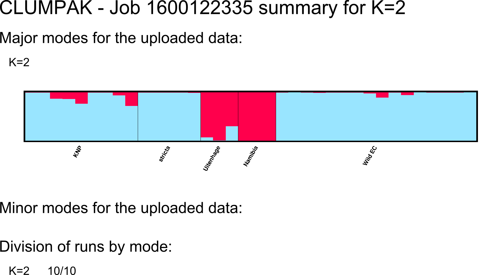
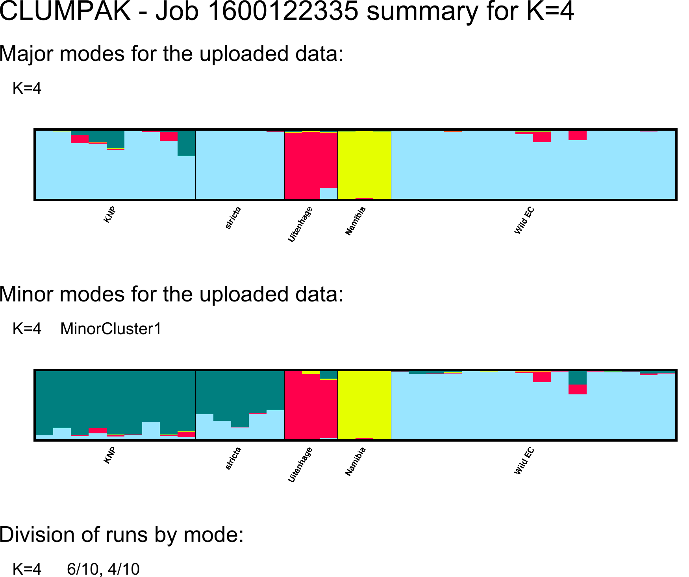
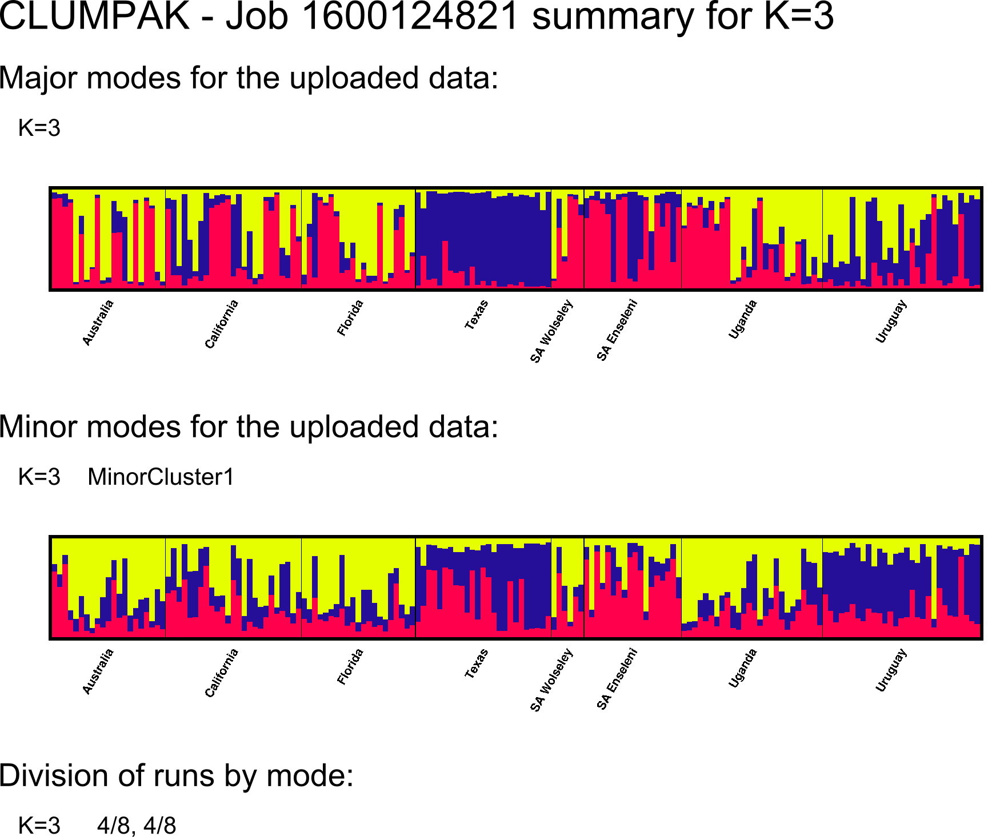
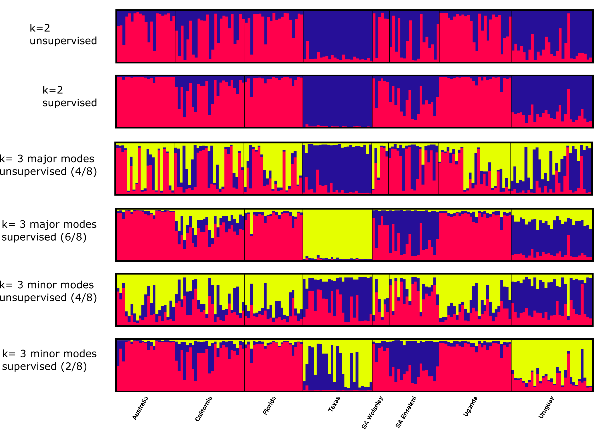
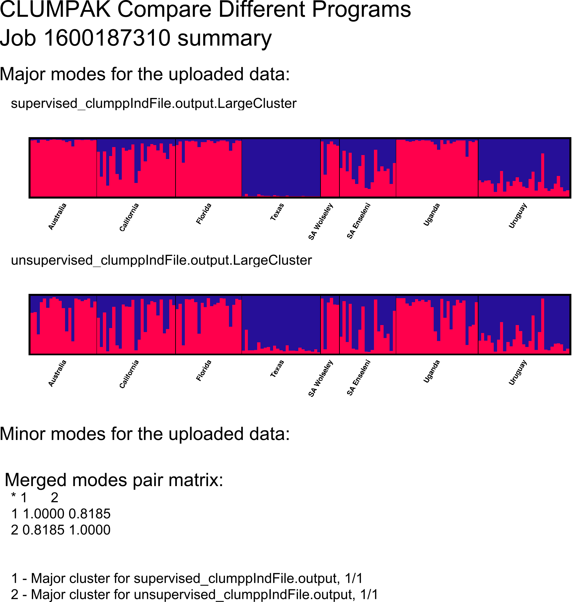
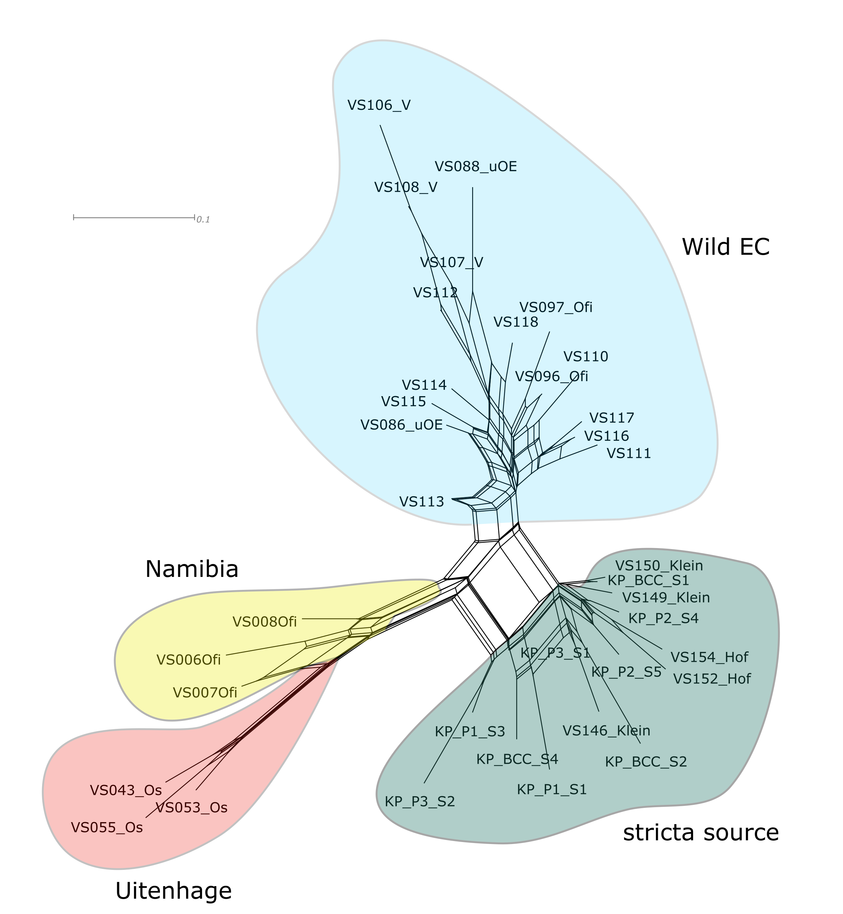

CBC Phylogenetics Tutorial 6: STRUCTURE and SplitsTree
================
Clarke van Steenderen
Last updated 15/09/2020

## AIMS OF THIS TUTORIAL :white\_check\_mark:

1.  Input ISSR (inter-simple sequence repeats) dominant marker, and SSR
    (simple sequence repeats) co-dominant data into the program
    STRUCTURE
2.  Find the estimated number of genetic clusters (K) present in the
    data (Structure Selector)
3.  Produce STRUCTURE plots of the output (CLUMPAK)
4.  Run a supervised and unsupervised STRUCTURE analysis, and compare
    the output
5.  Create a NEXUS file for ISSR binary data and input it to the
    SplitsTree program

## DOCUMENT CONTENTS

1.  [ISSR data (dominant)](#issr)
2.  [SSR data (co-dominant)](#ssr)
3.  [Supervised vs unsupervised STRUCTURE analysis](#compare_structure)
4.  [SplitsTree](#splitstree)

STRUCTURE reads in .txt files, so save your Excel file as a tab
delimited text file. Replace all missing data (“?”) with an integer that
doesn’t appear elsewhere in the data; -9 is often used. We will use some
*Dactylopius opuntiae*
([D.opuntiae\_SA\_structure.txt](https://github.com/CJMvS/CBC_Tutorials/blob/master/Tutorial_6/Dactylopius_ISSR/D.opuntiae_SA_structure.txt))
and *Neocheinta bruchi*
([hopper\_neochetina\_b.txt](https://github.com/CJMvS/CBC_Tutorials/blob/master/Tutorial_6/Neochetina_SSR/hopper_neochetina_b.txt))
ISSR and SSR data, respectively, in this tutorial.

## ISSR data (dominant) 

The table below shows the template of an input file for dominant marker
data for STRUCTURE:

|          |   | Locus 1 | Locus 2 | Locus 3 |
| -------- | - | ------- | ------- | ------- |
| Sample A | 1 | 0       | 0       | 1       |
| Sample B | 1 | 0       | \-9     | 1       |
| Sample C | 2 | 0       | 1       | 1       |
| Sample D | 3 | 1       | 1       | 1       |
| Sample E | 3 | 1       | 1       | \-9     |

> :bulb: Note that the first column contains sample names, the second
> contains integers indicating different groups (population
> information), and in this case, the third column is an additional
> information column that won’t be read into the analysis, but is just a
> reminder of what each grouping integer represents. See the [STRUCTURE
> manual](https://www.ncbi.nlm.nih.gov/pmc/articles/PMC3665925/#SM1) for
> other column information that can be included (also available in the
> **Software Manuals** folder). When specifying integers for groups,
> keep a note somewhere of which integer is which population. In the
> *Dactylopius opuntiae* data used in this tut, the groups are:

  - 1 = KNP
  - 2 = stricta source
  - 3 = Uitenhage
  - 4 = Namibia
  - 5 = Mass rearing facility (MRF)
  - 6 = Wild Eastern Cape (EC)

The Excel .csv file
[D.opuntiae\_SA\_structure.csv](https://github.com/CJMvS/CBC_Tutorials/blob/master/Tutorial_6/Dactylopius_ISSR/D.opuntiae_SA_structure.csv)
was saved as a .txt file, and then read into STRUCTURE.

#### To start a STRUCTURE analysis, follow these steps:

File –\> New project –\> Follow the project wizard to set the file
directory to select the [*Dactylopius opuntiae* input
.txt](https://github.com/CJMvS/CBC_Tutorials/blob/master/Tutorial_6/Dactylopius_ISSR/D.opuntiae_SA_structure.txt)
file –\> Input the **number of individuals** (check in the Excel file.
In this example, there are 36 individuals) –\> set **ploidy** to 1 (as
ISSRs are dominant markers) –\> check the **number of loci** in the
Excel file (here there are 419) –\> specify the integer used to signify
**missing data** (here a -9) –\> check the box indicating that there is
a **row of marker names** –\> check **“individual ID for each
individual”** (this is the info in column 1) –\> check **“putative
population origin for each individual”** (integers in column 2
corresponding to where the sample was collected)

Once the data has been successfully read into the program, click on
**Parameter Set** –\> **New** –\> set **burnin** to 5000 and **Number of
MCMC reps after burnin** to 2500 –\> Under the **Ancestry Model** tab,
ensure that the **Use Admixture Model** is selected. You would typically
run this whole analysis twice: once where the **use sampling locations
as prior** is selected (“supervised clustering”), and once where it is
not (“unsupervised clustering”). Leave it unchecked for this run –\>
when asked to name the parameter set, use **5000,2500** (burnin,mcmc
reps) with no space after the comma).

> Don’t forget to repeat the same analysis, with the same parameters,
> but check the **use sampling locations as prior** to enable supervised
> clustering. In doing this, the predefined population groupings
> provided in the second column are used by the algorithm as prior
> information. Compare the output from both runs. This second supervised
> run is “recommended for cases in which the inferred population
> structure is weak, or the populations examined are very closely
> related” [Kopelman *et al.*
> (2016)](https://rosenberglab.stanford.edu/papers/KopelmanEtAl2015-MolEcolResources.pdf).

Now click on **Project** –\> **Start a job** –\> select the name of the
run (here **5000,2500**) –\> set K from **1** to **10** (K is the number
of populations in your data. Set this a little higher than the number
you expect. In this example, we have five populations. To get good
coverage, let’s start by setting the maximum to 10) –\> Set the
**iterations** to 10 (have a look
[here](https://www.genetics.org/content/genetics/203/4/1827.full.pdf)
for examples of STRUCTURE settings in other studies).

> :bulb: [Wang
> (2017)](https://onlinelibrary.wiley.com/doi/full/10.1111/1755-0998.12650)
> and [Peuchmaille
> (2016)](https://onlinelibrary.wiley.com/doi/10.1111/1755-0998.12512)
> suggest that the optimal burnin and MCMC reps after burnin should be
> in the range of 100 000 and 50 000, respectively. We’re just setting
> these values lower here to speed things up.

Now click on **Project** –\> **Start a job** –\> Leave the analysis to
run to completion.

Zip the **Results** folder created by Structure, and upload it to the
[Structure Selector
server](https://lmme.ac.cn/StructureSelector/?_ga=2.128163340.1275430146.1600087475-472650450.1600087475).
Under “Options”, set the **Threshold** to 0.5-0.8 ([Peuchmaille
(2016)](https://onlinelibrary.wiley.com/doi/10.1111/1755-0998.12512)).
The results produced here tell you what the predicted K value is, or
rather, how many distinct genetic clusters are detected in your data.

> For this run, the Peuchmaille method suggests that K = 4 at all three
> threshold levels, and the Evanno method suggests that K = 2. In this
> case, present plots for both K = 2 and K = 4.

You can also run CLUMPAK straight from Structure Selector too, or you
can upload the same zipped Results folder to the [CLUMPAK
server](http://clumpak.tau.ac.il/). In the advanced settings in
Structure Selector, add a .txt file indicating which colours to assign
to each cluster group, and labels you want designated to each group
(designated integers in column 2) (optional). For example, a text file
for colours could be:

1 color46  
2 red  
3 yellow  
4 sea\_green  
5 light\_purple

See page 5 of the
[Destruct](https://rosenberglab.stanford.edu/software/distructManual.pdf)
manual for colour options.

And labels could be:

1 KNP  
2 stricta  
3 Uitenhage  
4 Namibia  
5 Wild EC

These are stored as
[**colours.txt**](https://github.com/CJMvS/CBC_Tutorials/blob/master/Tutorial_6/Dactylopius_ISSR/colours.txt)
and
[**names.txt**](https://github.com/CJMvS/CBC_Tutorials/blob/master/Tutorial_6/Dactylopius_ISSR/names.txt)
in the **Tutorial\_6/Dactylopius\_ISSR** folder.

## The output for **K = 2** and **K = 4** on CLUMPAK is:    

## 

   

Note the major and minor modes reported in the K = 4 output. We ran 10
repeats for each value of K, and so this is indicating that 6 out of the
10 produced the clustering pattern in the first diagram, and 4 of the 10
produced the second. These minor clustering possibilities may be
biologically meaningful. For a more in-depth discussion, see the
[Kopelman *et al.*
(2016)](https://rosenberglab.stanford.edu/papers/KopelmanEtAl2015-MolEcolResources.pdf)
paper.

## SSR data (co-dominant) 

The table below shows the template for co-dominant data for STRUCTURE:

|          |   | Locus 1 |     | Locus 2 |     |
| -------- | - | ------- | --- | ------- | --- |
| Sample A | 1 | 260     | 260 | 240     | 241 |
| Sample B | 1 | 260     | 262 | 240     | 242 |
| Sample C | 2 | 250     | \-9 | 235     | 230 |
| Sample D | 3 | 255     | 255 | 270     | 270 |
| Sample E | 3 | 255     | 250 | 275     | \-9 |

Edit the
[**hopper\_neochetina\_b.csv**](https://github.com/CJMvS/CBC_Tutorials/blob/master/Tutorial_6/Neochetina_SSR/hopper_neochetina_b.csv)
file such it looks like the [text
file](https://github.com/CJMvS/CBC_Tutorials/blob/master/Tutorial_6/Neochetina_SSR/hopper_neochetina_b.txt)
with the same name (in the **Tutorial 6/Neochetina\_SSR** folder).
Replace population names with integers to signify grouping.

> :bulb: SSR data input is the same as before, but because this is
> co-dominant (i.e. you can tell whether alleles are heterozygous or
> not), there are two columns for each locus. The *Neochetina* data
> contains 171 individuals and 8 loci. All the input parameters are the
> same as before, except that **ploidy** must be set to 2, and the
> **““special format data: file stores data for individuals in a
> single line”** check box must be selected in the project wizard
> settings.

In the Hopper *et al.* (2018) data, the groups are:

  - 1 = Australia
  - 2 = California
  - 3 = Florida
  - 4 = Texas
  - 5 = SA wolseley
  - 6 = SA Enseleni
  - 7 = Uganda
  - 8 = Uruguay

The [.txt file for
colours](https://github.com/CJMvS/CBC_Tutorials/blob/master/Tutorial_6/Neochetina_SSR/colours.txt),
and the [.txt file for group
names](https://github.com/CJMvS/CBC_Tutorials/blob/master/Tutorial_6/Neochetina_SSR/names.txt)
is in the **Tutorial 6/Neochetina\_SSR** folder.

In supplementary data file appendix 5 of the Hopper paper, STRUCTURE was
run with 1 million mcmc reps and 100 000 burnin; with K set from 1 to
10, with 10 repeats for each K value. Just as a demonstration, we’ll run
this with 10 000 burnin and 5000 mcmc reps, with K set from 1 to 10, and
8 repeats for each value of K. We’ll also set the threshold from 0.5 to
0.8.

From this short run, Structure Selector found support for **K = 2** and
**K = 3**. The CLUMPAK output for these are:

## 

   

For K = 3, half of the 8 repeats produced the first plot, and the other
half produced the second.

:bulb: Let’s re-run this analysis with the same parameters as before,
but under the **Ancestry Model** settings, select **“Use sampling
locations as prior (LOCPRIOR)”**.

Zip the **Results** folder, and upload to Structure Selector again. This
analysis supports K = 2, K = 3, and K = 4. Comparing these to the
unsupervised CLUMPAK results:

## Supervised vs unsupervised STRUCTURE analysis 

To compare the supervised and unsupervised runs for a particular K
(we’ll just do this for the major cluster groups for K = 2), after
Structure Selector has run for each, select the desired K value to
produce the graphical presentation. Click on **Download CLUMPAK
results** (both of these folders are in the
**Tutorial\_6/Neochetina\_SSR** folder, saved as
**CLUMPAK\_supervisedK=2** and **CLUMPAK\_unsupervisedK=2**). Open each
nested folder until you get to one called **MajorCluster**. Open the
**CLUMPP.files** folder. Create a new folder (here I named them
**supervised\_clumppIndFile.output** and
**unsupervised\_clumppIndFile.output**), and paste the
**ClumppIndFile.output** into it. Zip the folder. (Do this for both the
supervised and unsupervised runs). Open the
[CLUMPAK](http://clumpak.tau.ac.il/) server, and go to the **Compare**
tab. Upload both zipped folders you created, each containing the
ClumppIndFile.output. The similarity score for the supervised and
unsupervised run here is 0.82 (82%). This is the output:

   

## SplitsTree :herb: 

Let’s create a SplitsTree plot for each dataset.

First, we need to create a NEXUS file for the data. Follow these steps:

  - Create a new Excel sheet, and copy and paste the original data into
    it (i.e. the **D.opuntiae\_SA\_structure.csv** file that was later
    saved as a .txt file to read into STRUCTURE).

  - Remove the second grouping column (integers), and the first row of
    marker names

  - Save as a .txt file

  - Open the .txt file in Notepad++, and shorten the names (hold in the
    alt key to select multiple lines at the same time to delete sections
    of the names)

  - Replace the -9 values with ?

  - Remove all the spaces between values by doing a find and replace:
    **Find:** \[ \\t\]+ **Replace:** leave blank. Make sure that
    **Regular expression** is selected under **Search mode**

  - Replace spaces/tabs between the sample names and the string of 0s
    and 1s (make sure that this ends at the right place after the sample
    name\!)

  - Add this block to the top of the document:

-----

\#NEXUS  
\[Dactylopius opuntiae ISSR data\]

begin taxa;  
dimensions ntax=36;  
end;

begin characters;

dimensions nchar=419; format datatype=standard missing=?;

matrix

-----

  - And this to the end, underneath the last sample row:

-----

;  
end;

-----

  - Save a copy as a NEXUS file (.nex extension). This is saved as
    [**dactylopius\_splitstree.nex**](https://github.com/CJMvS/CBC_Tutorials/blob/master/Tutorial_6/Dactylopius_ISSR/dactylopius_splitstree.nex)
    in the **Dactylopius\_ISSR** folder.

Now open SplitsTree –\> File –\> Open –\> Select Files of type Nexus
files –\> Distances –\> uncorrected p –\> in the menu under the
**Characters** tab, select **Jaccard** –\> under the **Distances** tab,
make sure that **NeighborNet** is selected –\> Apply. Use ctrl + = to
increase the font size of sample names. To bootstrap data, go to
Analysis –\> Bootstrap –\> set the number (here it was set to 500) –\>
to hide bootstrap values, go to View –\> Format nodes and edges –\>
select the edge labels confidence box. The scale bar indicates 0.1
substitutions/site. The Jaccard Index is used, because it does not take
the shared absence of bands/peaks into account (as it is not
biologically meaningful) when calculating a distance matrix.

To export, go to File –\> Export image –\> select .svg –\> open in
Inkscape –\> edit and make it attractive\!

